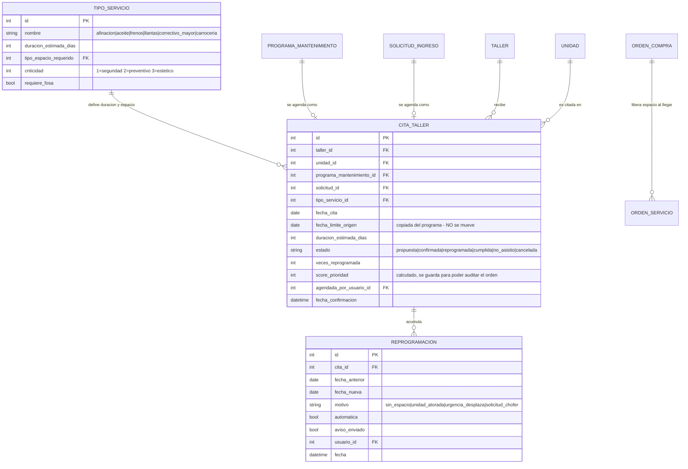

# Diseño de la agenda automática de mantenimiento

**Versión:** 1.0 · **Fecha:** 2026-08-15
**Resuelve:** las dudas sobre P3 y P4 en [procesos.md](procesos.md) — cuándo y cómo se recalcula
la agenda cuando el taller está lleno.
**Dueño del proceso:** Víctor (Programador de mantenimiento).

---

## 1. El error que hay que evitar antes de programar nada

La idea de "si el taller está lleno, se posterga un día más" es correcta como intuición, pero si
se implementa tal cual produce un sistema en el que **nadie confía**, por tres razones:

1. Si la fecha se mueve sola, el chofer que ya venía en camino se encuentra con que su cita
   cambió. A la tercera vez deja de mirar la app.
2. Si mover la cita también mueve la fecha límite, el mantenimiento se puede posponer para
   siempre y el sistema pierde su razón de existir.
3. "El taller está lleno" no es una sola cosa: el taller puede estar lleno **de pipas** y tener
   espacios de reparto libres.

La solución a los tres problemas es la misma: **separar dos fechas que hoy están confundidas.**

| Concepto | Campo | ¿Se mueve? | Quién manda |
|---|---|---|---|
| **Fecha límite de mantenimiento** | `PROGRAMA_MANTENIMIENTO.fecha_limite` | **Nunca** | El plan (días / km). Es el compromiso técnico. |
| **Cita de taller** | `CITA_TALLER.fecha_cita` | Sí | La capacidad real del taller |

Con esa separación, la regla de la penalización se vuelve trivial y justa:

> **El chofer solo incumple si faltó a una cita confirmada.**
> Si el taller no pudo darle cita antes de la fecha límite, **el incumplimiento es del taller**, no
> del chofer, y el sistema lo debe reportar como tal.

Eso resuelve el problema que señalé en P3/P4: hoy el sistema castigaría al chofer por un problema
de capacidad que no es suyo.

---

## 2. Entidades nuevas



Y **dos campos nuevos** en entidades que ya existen:

| Entidad | Campo | Para qué |
|---|---|---|
| `ORDEN_SERVICIO` | `fecha_salida_estimada` | Sin esto no se puede proyectar cuándo se libera un espacio |
| `UNIDAD` | `prioridad_operativa` | Desempate: una pipa parada cuesta más que un utilitario parado |

---

## 3. Cuándo se recalcula la agenda

Tu propuesta —recalcular cuando el administrador saca un vehículo— es **correcta pero
incompleta**. Ese es el evento en que aparece capacidad nueva, pero la capacidad también
*desaparece*, y las necesidades también cambian. Son **cinco disparadores**:

| # | Evento | Qué provoca | Quién lo genera |
|---|---|---|---|
| **D1** | **Se libera un espacio** (sale un vehículo) | Aparece capacidad → jala hacia adelante las citas pendientes | Pedro / Pablo |
| **D2** | **Se ocupa un espacio no previsto** (llega un arrastre, una urgencia) | Se consume capacidad → empuja hacia atrás las citas propuestas | Pedro / Pablo |
| **D3** | **Cambia la fecha estimada de salida** de una unidad en reparación | Es el disparador que **más se olvida**: una unidad atorada esperando piezas bloquea su espacio y recorre toda la agenda | Erick (al registrar la ETA de las piezas) |
| **D4** | **Entra una necesidad nueva** (vence una ventana, se acepta una solicitud) | Se inserta en la cola según su prioridad | Víctor / el job diario |
| **D5** | **Job diario al abrir el taller** | Red de seguridad: recalcula todo y detecta citas que ya no caben antes de su fecha límite | Programador de tareas |

**D3 es el importante.** Aquí se conecta con P7: cuando Erick registra que las piezas llegan el
día 20, el sistema ya sabe que ese espacio se libera alrededor del 21 y puede agendar sobre esa
fecha. Sin ese dato, la agenda planea a ciegas.

**Mientras una unidad esté en `espera_refacciones` sin ETA de piezas, su espacio se considera
ocupado por tiempo indefinido.** Es pesimista a propósito: es preferible agendar de menos que
citar a un chofer para un espacio que no existirá.

---

## 4. Cómo se calcula

### 4.1 Capacidad — por tipo de espacio, nunca global

```
capacidad_libre(dia D, tipo T) =
      espacios_activos(T)
    − ocupados_hoy(T) que aún no tienen fecha_salida_estimada ≤ D
    − citas_confirmadas(T) que se traslapan con D
```

El traslape importa porque un servicio dura varios días: una afinación de 2 días que empieza el
lunes ocupa lunes y martes.

**Las zonas del plano que no cuentan** (yonke, área de lavado, oficina, contenedor de basura) ya
están marcadas con `ZONA_TALLER.cuenta_para_ocupacion = false`. Sin esa bandera la agenda creería
que hay 45 espacios más de los que hay.

### 4.2 El algoritmo

Es una **cola con prioridad** asignada a capacidad día por día. No hace falta nada más sofisticado
y conviene que no lo sea: un algoritmo que nadie entiende es un algoritmo en el que nadie confía.

```
para cada dia D desde hoy hasta hoy + 30:
    para cada tipo de espacio T:
        libres = capacidad_libre(D, T)
        cola   = citas pendientes de tipo T, ordenadas por prioridad
        mientras libres > 0 y cola no vacia:
            cita = cola.siguiente()
            si cita.duracion cabe antes de que el espacio se vuelva a necesitar:
                asignar cita a D
                libres -= 1
    las citas que no cupieron pasan al dia siguiente
```

**Horizonte de 30 días.** Más allá de eso el sistema no propone fecha: muestra "sin fecha
disponible" y **alerta a Víctor y al gerente**, porque eso ya no es un problema de agenda, es un
problema de capacidad del taller. Planear a 6 meses con datos que cambian a diario es inventar
certidumbre.

### 4.3 La prioridad de la cola

Ordenamiento **lexicográfico**, no una fórmula con pesos. Se compara el primer criterio; si hay
empate, el segundo; y así:

| # | Criterio | Orden | Por qué |
|---|---|---|---|
| 1 | **Criticidad del servicio** | seguridad → preventivo → estético | Frenos antes que hojalatería, siempre |
| 2 | **Días respecto a la fecha límite** | ascendente (los negativos primero) | Lo ya vencido va primero |
| 3 | **Veces reprogramada** | descendente | **Anti-inanición**, ver abajo |
| 4 | **Prioridad operativa de la unidad** | pipa → reparto → utilitario | Una pipa parada cuesta más |
| 5 | **Fecha de solicitud** | ascendente | FIFO como último desempate |

**Por qué lexicográfico y no una suma ponderada.** Con pesos (`0.4×criticidad + 0.3×atraso + …`)
tendrías que justificar de dónde salió cada número, y cuando alguien reclame por qué su unidad
quedó atrás no vas a poder explicarlo. Con orden lexicográfico la respuesta siempre es una frase:
*"tu unidad quedó después porque la otra tiene un servicio de seguridad"*. Se guarda
`score_prioridad` para poder auditar el orden después.

**El criterio 3 no es opcional.** Sin él, una unidad de baja prioridad que se aplaza una vez se
aplaza para siempre: cada día llegan casos más urgentes y nunca alcanza turno. Es el problema de
inanición clásico de las colas por prioridad. Contarle las reprogramaciones y usarlas para subirla
es lo que garantiza que toda unidad acabe entrando.

---

## 5. Estabilidad: qué se puede mover y qué no

Esta es la regla que decide si el sistema se usa o se abandona.

| Estado de la cita | ¿El recálculo la mueve? |
|---|---|
| `propuesta` (aún no confirmada) | **Sí**, libremente |
| `confirmada` con más de 48 h de anticipación | **Sí**, pero **notificando** al chofer y al supervisor |
| `confirmada` a menos de 48 h | **No automáticamente.** Requiere que Víctor lo autorice y avise |
| `cumplida`, `no_asistio` | Nunca |

**El sistema propone, Víctor confirma.** El recálculo automático genera citas en estado
`propuesta`; Víctor las revisa y confirma. A partir de ahí la cita es un compromiso con el chofer
y ya no se mueve sola.

Sí hay un caso de movimiento automático de una cita confirmada: cuando entra una **urgencia de
seguridad** que desplaza a un preventivo. En ese caso se registra en `REPROGRAMACION` con motivo
`urgencia_desplaza`, se avisa al chofer y al supervisor, y **la cita desplazada sube al tope de la
cola** por el criterio 3.

---

## 6. Cómo queda la penalización con esto

Con el diseño que propusiste (avisar al gerente y al administrador, ellos hablan en persona, y al
final marcan como atendido), el flujo queda así:

| Situación | ¿Hay incumplimiento? | Qué hace el sistema |
|---|---|---|
| El sistema no encontró cita antes de la fecha límite | **No es del chofer** | Alerta a Víctor y al gerente: **problema de capacidad del taller** |
| Se le dio cita y el chofer no se presentó | **Sí** | Avisa a gerente y a Erick para que hablen con él |
| El chofer canceló su cita sin reagendar | **Sí** | Igual que el anterior |
| Se reprogramó por decisión del taller | **No** | Solo registra; el reloj de la fecha límite sigue corriendo pero no genera falta |

Nota importante: la alerta se emite contra el **poseedor** de la unidad en la fecha de la cita, no
contra el titular. Si la unidad estaba prestada, el que faltó fue el receptor.

---

## 7. Lo que puede salir mal

| Riesgo | Mitigación |
|---|---|
| La agenda se recalcula tantas veces que las fechas bailan | Solo se mueven las citas `propuesta`; las confirmadas requieren aviso |
| Todo se marca como "urgente" y la prioridad deja de servir | La criticidad la define el `TIPO_SERVICIO` del catálogo, no quien captura |
| Las duraciones estimadas están mal y la agenda se desfasa | Comparar `duracion_estimada` contra la real y ajustar el catálogo cada mes |
| Un espacio bloqueado por reparación de infraestructura | `ESPACIO.estado = bloqueado` ya lo contempla; sale del cálculo |
| El taller nunca alcanza a cubrir la demanda | El horizonte de 30 días lo hace visible como alerta de capacidad, no como retrasos individuales |

---

## 8. Lo que falta definir

1. **¿Cuántos días dura cada tipo de servicio?** Sin el catálogo `TIPO_SERVICIO` cargado con
   duraciones reales, la agenda no puede calcular nada. Es el primer dato que hay que levantar
   con Pedro.
2. **¿Cuál es la prioridad operativa entre unidades?** Propuse pipa > reparto > utilitario. Hay
   que confirmarlo con el gerente.
3. **¿Cuánta anticipación mínima merece un chofer?** Propuse 48 h. Puede ser 24 h si la operación
   es más flexible.
4. **¿Quién cubre a Víctor cuando no está?** Pablo cubre a Pedro, pero la agenda no tiene
   suplente asignado.
5. **¿Se puede agendar en sábado?** El cálculo de capacidad necesita saber qué días opera el
   taller.
