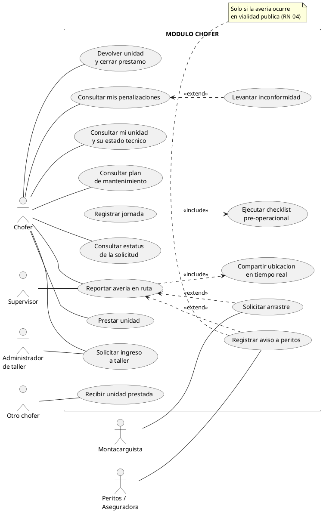

# Diagrama y catálogo de casos de uso — Sistema de Gestión de Flota y Taller (Baja Gas)

**Versión:** 1.1 · **Fecha:** 2026-08-13
**Documentos relacionados:** [requerimientos.md](requerimientos.md) · [modelo-er.md](modelo-er.md)

> **v1.1 — Se elimina el módulo Mecánico.** El cliente confirmó que los mecánicos no usarán la
> aplicación. Sus 7 casos de uso se reasignaron: 6 al administrador (que ahora **captura** lo que
> el mecánico le entrega en papel) y 1 al supervisor. El mecánico sigue apareciendo en los
> diagramas como **«business worker»** —con línea punteada— porque participa en el proceso pero
> **no opera el sistema**. Total sin cambio: 63 casos de uso, repartidos entre 5 módulos.

---

## 1. Diagramas

Los diagramas están en `docs/diagramas/` como **SVG** (escalables, se pegan en Word o
PowerPoint sin pixelarse). Para verlos todos juntos, abre
[`docs/diagramas/index.html`](diagramas/index.html) en el navegador.

| # | Archivo | Contenido |
|---|---|---|
| 0 | [00-contexto-general.svg](diagramas/00-contexto-general.svg) | Contexto: los 5 módulos, sus actores y los actores externos |
| 1 | [01-modulo-chofer.svg](diagramas/01-modulo-chofer.svg) | 15 casos de uso del chofer |
| 2 | [02-modulo-supervisor.svg](diagramas/02-modulo-supervisor.svg) | 9 casos de uso del supervisor |
| 3 | [03-modulo-administrador.svg](diagramas/03-modulo-administrador.svg) | 16 casos de uso del administrador de taller |
| 4 | [04-modulo-montacarguista.svg](diagramas/04-modulo-montacarguista.svg) | 7 casos de uso del montacarguista |
| 5 | [05-modulo-gerente.svg](diagramas/05-modulo-gerente.svg) | 9 casos de uso del gerente |

**Por qué está partido en 6 diagramas y no en uno solo:** 63 casos de uso y 10 actores en un solo
lienzo produce un diagrama ilegible, que es el error más común en este entregable. La práctica
correcta es un diagrama de contexto más un diagrama por subsistema. Si tu profesor pide "el"
diagrama, entrega el 0 como principal y los otros 5 como detalle.

**Convención de líneas en los diagramas:** línea continua = el actor **opera el sistema**; línea
punteada = **«business worker»**, participa en el proceso pero no toca la aplicación. Solo los
mecánicos, carroceros y electricistas están en el segundo grupo.

---

## 2. Actores

### Actores primarios (inician casos de uso)

| Actor | Descripción |
|---|---|
| **Chofer** | Opera la unidad y responde por su estado técnico mientras es el poseedor |
| **Supervisor** | Vigila una cuadrilla de choferes y sus unidades |
| **Administrador de taller** | Gestiona espacios, colas de trabajo y compras, y **captura el trabajo de los técnicos** |
| **Montacarguista** | Ejecuta arrastres de unidades varadas |
| **Gerente** | Dirección: aprueba presupuestos y consulta indicadores |

### Actores secundarios (participan, no inician)

| Actor | Participa en |
|---|---|
| **Otro chofer** | Recepción de una unidad en préstamo |
| **Almacén** | Autorización y surtido de órdenes de compra |
| **Proveedor** | Seguimiento de piezas en camino |
| **Peritos / Aseguradora** | Siniestros en vialidad pública |

### «business worker» — participa en el proceso, no usa el sistema

| Actor | Participa en |
|---|---|
| **Mecánico, carrocero, electricista** | Entrega diagnóstico, presupuesto y avance **en papel** al administrador, que los captura. Recibe su cola de trabajo impresa. |

**Por qué se dibuja si no usa el sistema.** En UML estricto, un actor es quien intercambia
información **con el sistema**; si el mecánico nunca lo toca, no es actor y debería salir del
diagrama. Pero borrarlo esconde de dónde vienen los datos y hace que casos como "capturar
presupuesto" parezcan inventados por el administrador. La solución estándar es el modelado de
casos de uso **de negocio**: se dibuja con el estereotipo «business worker» y **línea punteada**,
que lo distingue visualmente de un usuario real. Si tu profesor exige UML estricto de sistema,
quítalo del diagrama y déjalo solo como nota — el contenido no cambia.

### Actor temporal

| Actor | Descripción |
|---|---|
| **Programador de tareas** | Reloj del sistema. Dispara los casos automáticos: generar penalizaciones al vencer la ventana de mantenimiento, alertar unidades con más de 3 meses paradas y cerrar préstamos vencidos. |

**Nota de modelado:** el *Programador de tareas* es un actor legítimo en UML, no un truco. Sin él,
casos como "generar penalización" quedarían huérfanos: ningún humano los inicia y sin embargo
ocurren. Es la forma correcta de representar RN-05 y RN-08 en un diagrama de casos de uso.

Los seis actores primarios **heredan** de un actor abstracto **Usuario del sistema**, que aporta
`CU-GEN-01 Iniciar sesión` y `CU-GEN-02 Recibir notificaciones`. Por eso esos dos casos no se
repiten en cada diagrama de módulo.

---

## 3. Catálogo de casos de uso

Prioridad heredada del MoSCoW de [requerimientos.md](requerimientos.md).

### 3.1 Comunes (CU-GEN)

| ID | Caso de uso | Actor | Requisito | Prioridad |
|---|---|---|---|---|
| CU-GEN-01 | Iniciar sesión | Usuario del sistema | RF-GEN-01 | Must |
| CU-GEN-02 | Recibir notificaciones | Usuario del sistema | RF-GEN-05 | Must |
| CU-GEN-03 | Administrar catálogos (usuarios, unidades, talleres, piezas) | Administrador, Gerente | RF-GEN-03 | Must |
| CU-GEN-04 | Consultar bitácora de auditoría | Gerente | RF-GEN-04 | Must |

### 3.2 Módulo Chofer (CU-CHO)

| ID | Caso de uso | Actores | Requisito | Prioridad |
|---|---|---|---|---|
| CU-CHO-01 | Consultar mi unidad y su estado técnico | Chofer | RF-CHO-01 | Must |
| CU-CHO-02 | Consultar plan de mantenimiento | Chofer | RF-CHO-02 | Must |
| CU-CHO-03 | Registrar jornada | Chofer | RF-CHO-14 | Should |
| CU-CHO-04 | Ejecutar checklist pre-operacional | Chofer | RF-CHO-13 | Should |
| CU-CHO-05 | Solicitar ingreso a taller | Chofer, Administrador | RF-CHO-03 | Must |
| CU-CHO-06 | Consultar estatus de la solicitud | Chofer | RF-CHO-04 | Must |
| CU-CHO-07 | Prestar unidad | Chofer | RF-CHO-05 | Must |
| CU-CHO-08 | Recibir unidad prestada | Otro chofer | RF-CHO-06 | Must |
| CU-CHO-09 | Devolver unidad y cerrar préstamo | Chofer | RF-CHO-07 | Must |
| CU-CHO-10 | Reportar avería en ruta | Chofer, Supervisor | RF-CHO-08 | Must |
| CU-CHO-11 | Registrar aviso a peritos | Chofer, Peritos | RF-CHO-09 | Must |
| CU-CHO-12 | Solicitar arrastre | Chofer, Montacarguista | RF-CHO-08 | Must |
| CU-CHO-13 | Compartir ubicación en tiempo real | Chofer | RF-CHO-10 | Must |
| CU-CHO-14 | Consultar mis penalizaciones | Chofer | RF-CHO-11, RF-CHO-15 | Must |
| CU-CHO-15 | Levantar inconformidad | Chofer | RF-CHO-16 | Could |

### 3.3 Módulo Supervisor (CU-SUP)

| ID | Caso de uso | Actores | Requisito | Prioridad |
|---|---|---|---|---|
| CU-SUP-01 | Consultar mi cuadrilla | Supervisor | RF-SUP-01 | Must |
| CU-SUP-02 | Monitorear conductores y unidades en tiempo real | Supervisor | RF-SUP-02, RF-SUP-06 | Must |
| CU-SUP-03 | Consultar préstamos activos | Supervisor | RF-SUP-03 | Must |
| CU-SUP-04 | Autorizar o vetar un préstamo | Supervisor, Chofer | RF-SUP-07 | Should |
| CU-SUP-05 | Consultar estado de la unidad (taller / ruta / averiada) | Supervisor | RF-SUP-04 | Must |
| CU-SUP-06 | Atender alerta de unidad varada | Supervisor | RF-SUP-05 | Must |
| CU-SUP-07 | Despachar apoyo a la unidad varada | Supervisor, Montacarguista | RF-SUP-09 | Should |
| CU-SUP-08 | Consultar cumplimiento de mantenimiento de la cuadrilla | Supervisor | RF-SUP-08 | Should |
| CU-SUP-09 | Registrar envío de mecánico a sitio | Supervisor, Mecánico *(business worker)* | RF-SUP-09 | Should |

### 3.4 Módulo Administrador de taller (CU-ADM)

| ID | Caso de uso | Actores | Requisito | Prioridad |
|---|---|---|---|---|
| CU-ADM-01 | Atender solicitud de ingreso al taller | Administrador, Chofer | RF-ADM-01, RF-ADM-03 | Must |
| CU-ADM-02 | Verificar disponibilidad de espacios | Administrador | RF-ADM-02 | Must |
| CU-ADM-03 | Gestionar espacios del taller | Administrador | RF-ADM-04 | Must |
| CU-ADM-04 | Colocar o retirar unidad de un espacio | Administrador | RF-ADM-05 | Must |
| CU-ADM-05 | Asignar cola de especialistas al vehículo | Administrador | RF-ADM-06 | Must |
| CU-ADM-06 | Reordenar la cola de trabajo | Administrador | RF-ADM-07 | Should |
| CU-ADM-07 | Remitir presupuesto al gerente | Administrador, Gerente | RF-ADM-09 | Must |
| CU-ADM-08 | Autorizar orden de compra de piezas | Administrador, Almacén | RF-ADM-10 | Must |
| CU-ADM-09 | Dar seguimiento a piezas en camino | Administrador, Proveedor | RF-ADM-11 | Should |
| CU-ADM-10 | Emitir formato de salida | Administrador, Chofer | RF-ADM-08 | Must |
| CU-ADM-11 | **Capturar diagnóstico del mecánico** | Administrador, Mecánico *(bw)* | RF-ADM-15 | Must |
| CU-ADM-12 | **Capturar presupuesto del mecánico** | Administrador, Mecánico *(bw)* | RF-ADM-09 | Must |
| CU-ADM-13 | **Registrar piezas faltantes** | Administrador | RF-ADM-16 | Must |
| CU-ADM-14 | **Registrar avance y término de la reparación** | Administrador | RF-ADM-17 | Must |
| CU-ADM-15 | **Emitir hoja de trabajo del día en papel** | Administrador, Mecánico *(bw)* | RF-ADM-18 | Must |
| CU-ADM-16 | **Registrar aviso al mecánico del resultado** | Administrador, Mecánico *(bw)* | RF-ADM-19 | Should |

*(bw) = business worker: recibe o entrega en papel, no opera el sistema.*

### 3.5 Módulo Mecánico — **ELIMINADO**

El cliente confirmó que los mecánicos no usarán la aplicación. Se conserva la trazabilidad para
que ningún requerimiento desaparezca en silencio:

| ID original | Caso de uso | Destino | Nuevo ID |
|---|---|---|---|
| CU-MEC-01 | Consultar mi cola de trabajo | Se imprime en papel | CU-ADM-15 |
| CU-MEC-02 | Registrar diagnóstico | Lo captura el administrador | CU-ADM-11 |
| CU-MEC-03 | Listar piezas faltantes | Lo captura el administrador | CU-ADM-13 |
| CU-MEC-04 | Elaborar y enviar presupuesto | Lo elabora en papel, el admin lo captura | CU-ADM-12 |
| CU-MEC-05 | Consultar resolución del presupuesto | Aviso verbal, el sistema deja constancia | CU-ADM-16 |
| CU-MEC-06 | Registrar avance y término | Lo captura el administrador | CU-ADM-14 |
| CU-MEC-07 | Atender auxilio mecánico en sitio | Lo registra el supervisor | CU-SUP-09 |

**Ningún caso de uso se perdió: los 7 se reubicaron.** Eso confirma que el trabajo del mecánico
seguía siendo necesario para el negocio; lo único que cambió es **quién teclea**.

### 3.6 Módulo Montacarguista (CU-MON)

| ID | Caso de uso | Actores | Requisito | Prioridad |
|---|---|---|---|---|
| CU-MON-01 | Recibir alerta de unidad varada | Montacarguista, Supervisor | RF-MON-01 | Must |
| CU-MON-02 | Aceptar o rechazar el arrastre | Montacarguista | RF-MON-02 | Must |
| CU-MON-03 | Transmitir mi ubicación en tiempo real | Montacarguista, Chofer | RF-MON-03 | Must |
| CU-MON-04 | Registrar llegada al sitio | Montacarguista | RF-MON-05 | Should |
| CU-MON-05 | Cerrar arrastre y registrar taller destino | Montacarguista, Administrador | RF-MON-04 | Must |
| CU-MON-06 | Adjuntar evidencia fotográfica | Montacarguista | RF-MON-07 | Should |
| CU-MON-07 | Consultar historial de arrastres | Montacarguista | RF-MON-06 | Should |

### 3.7 Módulo Gerente (CU-GER)

| ID | Caso de uso | Actores | Requisito | Prioridad |
|---|---|---|---|---|
| CU-GER-01 | Consultar dashboard general | Gerente | RF-GER-01 | Must |
| CU-GER-02 | Consultar incumplimiento de mantenimiento preventivo | Gerente | RF-GER-02 | Must |
| CU-GER-03 | Consultar ocupación del taller en tiempo real | Gerente | RF-GER-03 | Must |
| CU-GER-04 | Consultar historial del taller | Gerente | RF-GER-04 | Must |
| CU-GER-05 | Consultar piezas en camino por unidad | Gerente | RF-GER-05 | Must |
| CU-GER-06 | Consultar tiempo de permanencia por unidad | Gerente | RF-GER-06 | Must |
| CU-GER-07 | Atender alerta de unidad con más de 3 meses parada | Gerente, Programador de tareas | RF-GER-07 | Must |
| CU-GER-08 | Aprobar o rechazar presupuesto | Gerente, Administrador | RF-GER-09 | Must |
| CU-GER-09 | Consultar unidades atendidas por periodo | Gerente | RF-GER-08 | Must |

### 3.8 Casos automáticos (CU-AUT)

| ID | Caso de uso | Actor | Regla | Prioridad |
|---|---|---|---|---|
| CU-AUT-01 | Generar penalización por mantenimiento vencido | Programador de tareas | RN-05 | Must |
| CU-AUT-02 | Generar alerta de unidad con más de 3 meses parada | Programador de tareas | RN-08 | Must |
| CU-AUT-03 | Cerrar préstamos vencidos y devolver la responsabilidad al titular | Programador de tareas | RN-03 | Must |

**Total: 63 casos de uso.**

---

## 4. Relaciones «include» y «extend»

La diferencia, que es donde se equivoca casi todo el mundo:

- **«include»** = el caso base **siempre** ejecuta al incluido. Es obligatorio.
- **«extend»** = el caso extensión ocurre **solo bajo una condición**. Es opcional.

| Origen | → | Destino | Tipo | Condición / motivo |
|---|---|---|---|---|
| CU-CHO-03 Registrar jornada | → | CU-CHO-04 Ejecutar checklist | «include» | No se abre jornada sin checklist |
| CU-CHO-10 Reportar avería | → | CU-CHO-13 Compartir ubicación | «include» | La ubicación es parte del reporte |
| CU-CHO-10 Reportar avería | → | CU-CHO-11 Registrar aviso a peritos | «extend» | **Solo si** ocurrió en vialidad pública (RN-04) |
| CU-CHO-10 Reportar avería | → | CU-CHO-12 Solicitar arrastre | «extend» | Solo si la unidad no puede moverse por su cuenta |
| CU-CHO-14 Consultar penalizaciones | → | CU-CHO-15 Levantar inconformidad | «extend» | Solo si el chofer no está de acuerdo |
| CU-ADM-01 Atender solicitud | → | CU-ADM-02 Verificar espacios | «include» | Nunca se decide sin revisar disponibilidad (RN-06) |
| CU-ADM-05 Asignar cola | → | CU-ADM-06 Reordenar cola | «extend» | Solo si cambia la prioridad |
| CU-ADM-12 Capturar presupuesto | → | CU-ADM-13 Registrar piezas faltantes | «include» | No hay presupuesto sin desglose de piezas |
| CU-MON-05 Cerrar arrastre | → | CU-MON-06 Adjuntar evidencia | «include» | Protege contra reclamos de daño |
| CU-SUP-06 Atender alerta | → | CU-SUP-07 Despachar apoyo | «extend» | Solo si el montacarguista no respondió |

---

## 5. Casos de uso expandidos

Se detallan los cuatro con más reglas de negocio. El resto sigue el mismo formato.

### CU-CHO-07 — Prestar unidad

| Campo | Contenido |
|---|---|
| **Actor primario** | Chofer titular |
| **Actores secundarios** | Otro chofer (receptor), Supervisor |
| **Objetivo** | Ceder temporalmente la unidad y **transferir la responsabilidad** |
| **Precondiciones** | El chofer es el poseedor actual; la unidad está `disponible` o `en_ruta`; no existe préstamo activo sobre ella |
| **Postcondición de éxito** | Existe un `PRESTAMO_UNIDAD` en estado `activo` y `UNIDAD.poseedor_chofer_id` apunta al receptor |
| **Disparador** | El chofer sale de vacaciones o se incapacita |

**Flujo principal**

1. El chofer selecciona su unidad y elige "Prestar unidad".
2. El sistema muestra los choferes elegibles (activos, con licencia vigente, sin unidad asignada en préstamo).
3. El chofer elige el receptor, el motivo (vacaciones / incapacidad / apoyo) y la fecha de retorno.
4. El sistema valida que no exista un préstamo activo sobre esa unidad **(RN-02)**.
5. El sistema registra el préstamo en estado `solicitado` y notifica al receptor y al supervisor.
6. El receptor ejecuta **CU-CHO-08 Recibir unidad prestada**.
7. Al aceptar, el sistema pasa el préstamo a `activo`, **cambia el poseedor** y registra el movimiento en la bitácora **(RN-01, RF-GEN-04)**.

**Flujos alternos**

- **3a.** El receptor tiene la licencia vencida → el sistema lo excluye de la lista.
- **4a.** Ya existe un préstamo activo → el sistema rechaza la operación e informa quién es el poseedor actual.
- **5a.** El supervisor veta el préstamo (**CU-SUP-04**) → el préstamo pasa a `rechazado` y la responsabilidad no se mueve.
- **6a.** El receptor no acepta en 24 h → el préstamo expira y la unidad sigue con el titular.
- **7a.** La unidad tiene una ventana de mantenimiento vencida → el sistema permite el préstamo pero **advierte al receptor** que hereda la obligación y la penalización pendiente.

---

### CU-CHO-10 — Reportar avería en ruta

| Campo | Contenido |
|---|---|
| **Actor primario** | Chofer (poseedor) |
| **Actores secundarios** | Supervisor, Peritos/Aseguradora, Montacarguista |
| **Objetivo** | Dejar la unidad varada visible y activar el apoyo correcto en el orden legal |
| **Precondiciones** | El chofer tiene jornada abierta con esa unidad |
| **Postcondición** | Existe un `REPORTE_AVERIA` con ubicación; la unidad queda en estado `varada` |

**Flujo principal**

1. El chofer elige "Reportar avería".
2. El sistema captura automáticamente su ubicación GPS **(«include» CU-CHO-13)**.
3. El chofer describe la falla, adjunta fotos e indica **si está en vialidad pública**.
4. El sistema crea el reporte y notifica en tiempo real al supervisor y al montacarguista.
5. La unidad aparece en el mapa del supervisor con estado `varada`.

**Flujos alternos**

- **3a. Está en vialidad pública →** el sistema **bloquea** la solicitud de arrastre y de auxilio mecánico, y exige ejecutar **CU-CHO-11 Registrar aviso a peritos** primero **(RN-04)**. Hasta que el chofer capture el folio del perito, el botón de arrastre permanece deshabilitado.
- **3b.** No hay señal → la app guarda el reporte localmente y lo sincroniza al recuperar cobertura **(RF-GEN-09)**; mientras tanto muestra la última ubicación conocida.
- **4a.** Ningún montacarguista acepta en 15 min → el supervisor recibe escalamiento y ejecuta **CU-SUP-07**.

---

### CU-ADM-01 — Atender solicitud de ingreso al taller

| Campo | Contenido |
|---|---|
| **Actor primario** | Administrador de taller |
| **Actores secundarios** | Chofer |
| **Objetivo** | Aceptar o rechazar el ingreso según la capacidad real del taller |
| **Precondiciones** | Existe una `SOLICITUD_INGRESO` en estado `pendiente` |
| **Postcondición** | La solicitud queda `aceptada`, `en_cola` o `rechazada`, y el chofer es notificado |

**Flujo principal**

1. El administrador abre la bandeja de solicitudes ordenada por urgencia y antigüedad.
2. Selecciona una solicitud y ve la unidad, la falla reportada y el tipo de servicio.
3. El sistema ejecuta **«include» CU-ADM-02 Verificar disponibilidad de espacios** y muestra los espacios libres **compatibles con el tipo de unidad** (una pipa no cabe en un espacio de reparto).
4. El administrador acepta y asigna fecha de ingreso.
5. El sistema notifica al chofer y reserva el espacio.

**Flujos alternos**

- **3a. No hay espacio compatible libre →** el administrador puede dejar la solicitud `en_cola` con posición y fecha estimada, o rechazarla **con motivo obligatorio (RN-06)**.
- **4a.** La solicitud corresponde a un mantenimiento preventivo cuya ventana está por vencer → el sistema la marca como prioritaria para no generar penalización injusta al chofer.
- **5a.** El chofer no se presenta en la fecha asignada → la reserva se libera y la ventana de mantenimiento sigue corriendo.

---

### CU-ADM-12 → CU-ADM-07 → CU-GER-08 — Ciclo del presupuesto (v1.1)

Esta es la **cadena** que implementa RN-07. Cambió con la salida del mecánico del sistema: ya no
hay un paso donde él envía el presupuesto por la aplicación.

| Paso | Caso de uso | Quién | Dentro / fuera del sistema | Resultado |
|---|---|---|---|---|
| 1 | — | Mecánico | **Fuera** | Diagnostica y escribe el presupuesto en papel |
| 2 | CU-ADM-11 Capturar diagnóstico | Administrador | Dentro | La orden de servicio pasa a `diagnostico` |
| 3 | CU-ADM-12 Capturar presupuesto | Administrador | Dentro | `PRESUPUESTO` en estado `capturado`, con `tecnico_elaboro_id` y `capturado_por_admin_id` |
| 4 | CU-ADM-13 Registrar piezas faltantes | Administrador | Dentro | «include» del paso 3 |
| 5 | CU-ADM-07 Remitir presupuesto al gerente | Administrador | Dentro | Estado `enviado_gerente` + registro en `AUTORIZACION` |
| 6 | CU-GER-08 Aprobar o rechazar | Gerente | Dentro | Estado `aprobado`, `rechazado` o `devuelto` |
| 7 | CU-ADM-16 Registrar aviso al mecánico | Administrador | Dentro (constancia) | El aviso es verbal; el sistema guarda `fecha_aviso_al_tecnico` |
| 8 | CU-ADM-08 Autorizar orden de compra | Administrador | Dentro | Solo si el paso 6 fue `aprobado` **(RI-07)** |

**Lo que se perdió y hay que compensar.** Antes el mecánico veía la resolución en su pantalla
(CU-MEC-05); ahora depende de que alguien se lo diga. Por eso existe CU-ADM-16: no automatiza el
aviso, pero **deja constancia de que se dio**. Si un mecánico alega que nunca le avisaron que su
presupuesto fue rechazado, hay un registro con fecha.

**Flujo alterno crítico:** en el paso 6 el gerente puede **devolver** el presupuesto con
comentarios. Vuelve al administrador, que se lo comunica al mecánico, este corrige el papel y el
administrador vuelve a capturar. Se registra la `AUTORIZACION` con resultado `devuelto` y el ciclo
se repite. **El historial de idas y vueltas se conserva**, que es lo que permite auditar por qué
una unidad lleva tres semanas parada.

**Riesgo del rediseño:** cada vuelta de este ciclo ahora tiene **dos traspasos verbales** más que
antes (gerente→admin→mecánico y de regreso). Cada traspaso es una oportunidad de retraso que el
sistema ya no puede medir. Vale la pena acordar con el cliente un tiempo máximo de aviso.

---

## 6. Código fuente PlantUML (para editar los diagramas)

Si necesitas modificar los diagramas, pega esto en [plantuml.com](https://www.plantuml.com/plantuml/uml/)
o en la extensión de VS Code. Se incluye el módulo Chofer como ejemplo; los demás siguen la misma
estructura.

---

## 7. Decisiones de modelado que conviene poder defender

1. **"Prestar unidad" y "Recibir unidad prestada" son dos casos de uso, no uno.** Los inician
   actores distintos en momentos distintos, y el préstamo no surte efecto hasta que el receptor
   acepta. Modelarlo como uno solo escondería el punto crítico: **cuándo cambia la
   responsabilidad**.

2. **"Registrar aviso a peritos" es «extend», no «include».** Solo aplica en vialidad pública. Si
   fuera «include», estarías obligando a llamar peritos cuando la unidad se descompone dentro del
   patio de la empresa.

3. **"Verificar disponibilidad de espacios" sí es «include».** El administrador nunca decide sin
   consultarlo; no hay camino alterno.

4. **Los casos automáticos (CU-AUT) existen y tienen un actor.** Un caso de uso sin actor está
   mal formado. Por eso el *Programador de tareas*.

4b. **El mecánico se dibuja como «business worker», no como actor del sistema.** Ver §2. Es la
   forma correcta de representar a alguien que participa en el proceso sin usar la aplicación,
   y evita el error contrario: borrarlo y que parezca que el administrador se inventa los
   diagnósticos.

5. **"Consultar dashboard" no incluye a los otros consultar-*.** El dashboard es una vista
   agregada, no una composición de casos de uso. Ponerle nueve flechas «include» sería ruido, no
   información.

---

## 8. Pendientes que cambian el diagrama

1. Si el préstamo **no** requiere autorización del supervisor, **CU-SUP-04 desaparece** y con él
   el flujo alterno 5a de CU-CHO-07.
2. Si el montacarguista es un **proveedor externo**, deja de ser actor primario con módulo propio
   y pasa a ser actor secundario; su módulo se reduce a notificaciones. Ojo: si además resultara
   que tampoco usa la app, el sistema se quedaría con 4 módulos y el administrador absorbería
   todavía más captura.
2b. **¿Carroceros y electricistas tampoco usan la app?** Se asumió que no. Si alguno sí, hay que
   reponerle sus casos de uso; el catálogo `TECNICO` ya lo contempla con una FK opcional a
   `USUARIO`.
3. Si existe un **monto máximo** que el administrador puede aprobar sin gerente, hay que agregar
   `CU-ADM-11 Aprobar presupuesto menor` y un flujo alterno en la cadena del presupuesto.
4. Falta definir quién ejecuta **CU-GEN-03 Administrar catálogos**: hoy lo comparten administrador
   y gerente, lo que en la práctica suele significar que nadie se hace cargo.
