# Diagramas de los procesos de negocio

**Versión:** 1.0 · **Fecha:** 2026-08-21
**Deriva de:** [procesos.md](procesos.md) §4 — un diagrama por cada uno de los 12 procesos.
**Relacionados:** [casos-de-uso.md](casos-de-uso.md) v2.0 · [modelo-clases.md](modelo-clases.md) v2.0

---

## Cómo leerlos

Son **diagramas de secuencia**, no de actividad. La elección no es estética: `procesos.md` §1
define un proceso por sus **traspasos entre roles** — *«el punto donde los procesos se rompen»* —
y en una secuencia cada traspaso es una flecha con emisor, receptor y nombre. Un diagrama de
actividad muestra el orden de los pasos pero difumina de quién es cada uno, que es justo el dato
que este análisis necesita.

| Convención | Significa |
|---|---|
| `Sistema` | El software. Equivale al **⚙** de las tablas de `procesos.md` §4 |
| Flecha continua `->>` | Acción que alguien inicia |
| Flecha punteada `-->>` | Respuesta, notificación o retorno |
| Bloque `alt` | Caminos excluyentes: pasa uno **o** el otro |
| Bloque `opt` | Paso condicional: puede no ocurrir |
| Bloque `loop` | Se repite |
| Recuadro sombreado | **Donde el proceso se rompe.** El riesgo que señala `procesos.md` |
| Actor con *(papel)* | Participa pero **no toca el sistema** |

**Los cuatro administradores van por su nombre** — Erick, Pedro, Víctor y Pablo — porque no hacen
lo mismo y no deben poder hacer lo mismo. Dibujarlos como un solo «Administrador» escondería la
separación de funciones, que es lo que un sistema de control debe hacer visible.

> **Aviso de versión.** `procesos.md` está en v1.1 y `casos-de-uso.md` en v2.0. Donde las dos
> discrepan, estos diagramas siguen a la **v2.0**, que es lo que el código implementa. Las tres
> diferencias están marcadas en el diagrama correspondiente y listadas al final en §13.

---

## P1 — Préstamo y transferencia de responsabilidad

**Disparador:** el titular se va de vacaciones o se incapacita.
**Dueño:** Chofer titular · **Traspasos:** 3 · **Casos de uso:** CU-CHO-08, CU-CHO-09, CU-SUP-04, CU-AUT-03

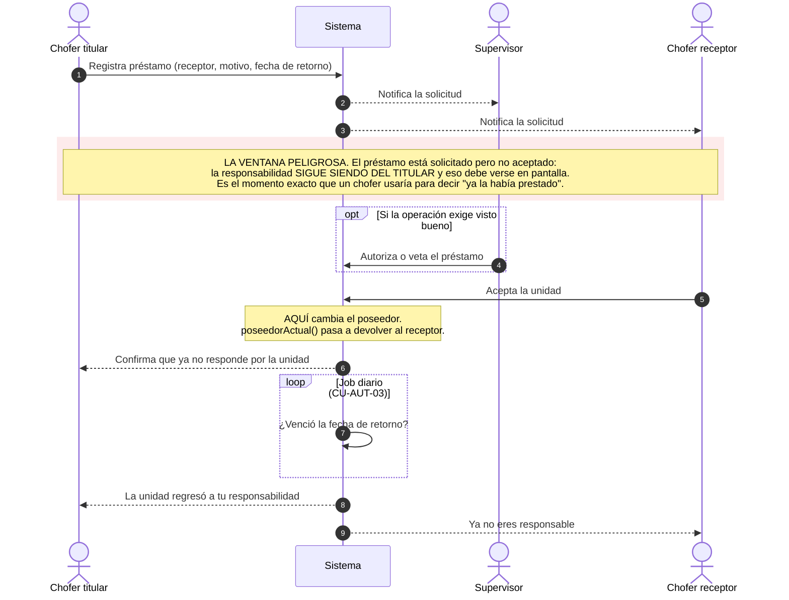

---

## P2 — Operación diaria y supervisión de flota

**Disparador:** inicio de turno.
**Dueño:** Supervisor · **Traspasos:** 2 · **Casos de uso:** CU-CHO-03, CU-CHO-04, CU-SUP-01, CU-SUP-02, CU-SUP-05

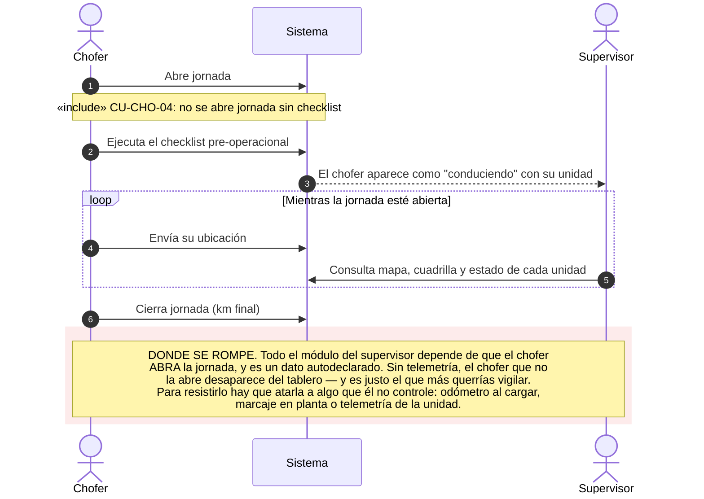

---

## P3 — Mantenimiento preventivo programado

**Disparador:** se cumple la fecha o el kilometraje del plan.
**Dueño:** Víctor (agenda) · **Traspasos:** 3 · **Casos de uso:** CU-ADM-13, CU-CHO-07, CU-AUT-04, CU-AUT-05

> **v2.0 — se invirtió quién empieza.** Antes el chofer solicitaba el ingreso preventivo. Ahora
> **Víctor agenda y el chofer confirma**, lo que saca el conflicto de interés del camino crítico.

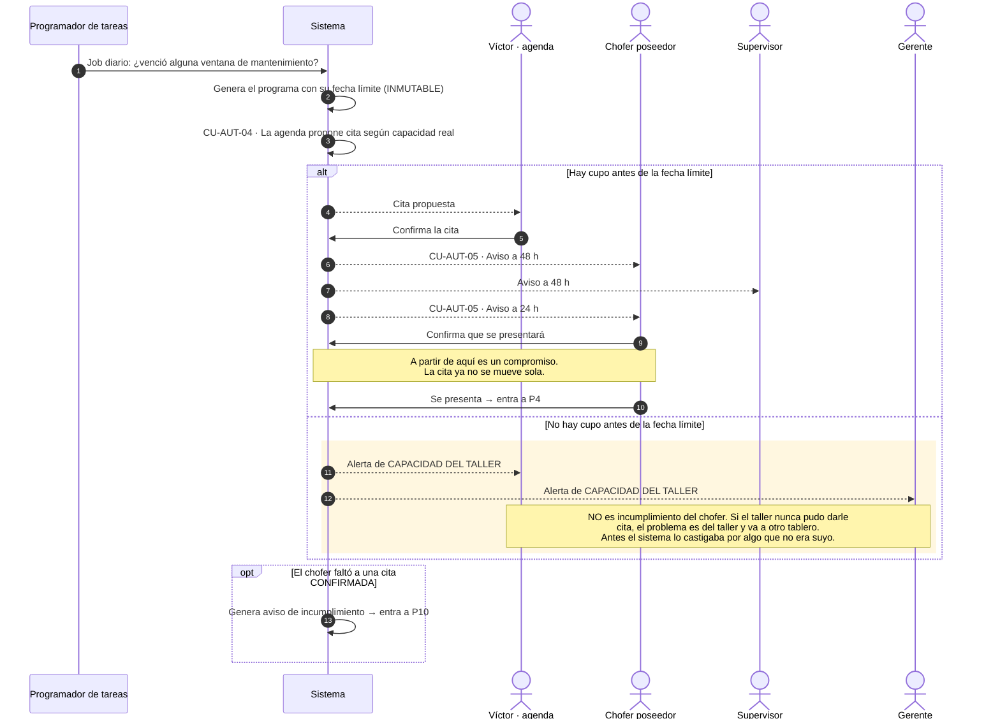

---

## P4 — Ingreso a taller: solicitud y admisión

**Disparador:** el chofer solicita entrar *(correctivo)* o llega a su cita *(preventivo)*.
**Dueño:** Pedro (piso) · **Traspasos:** 4 · **Casos de uso:** CU-CHO-05, CU-CHO-06, CU-ADM-01, CU-ADM-02, CU-ADM-04

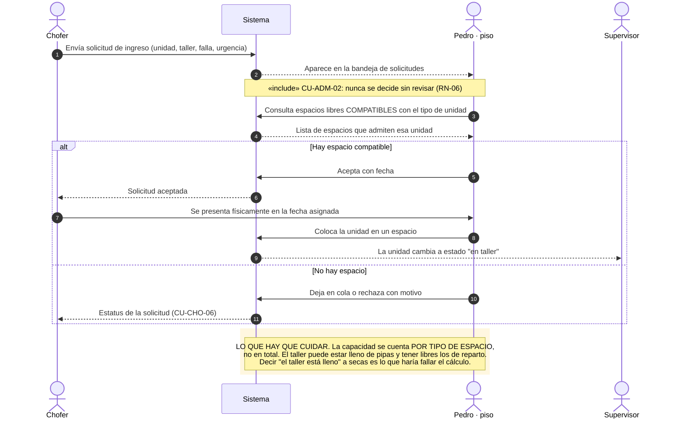

---

## P5 — Reparación en taller

**Disparador:** la unidad queda colocada en un espacio.
**Dueño:** Pedro (cola) y Erick (captura) · **Traspasos:** **6** · **Casos de uso:** CU-ADM-05 a CU-ADM-10, CU-MEC-01/02/06

> **v2.0 — hay dos caminos y no se parecen.** El mecánico de Álamos no usa la app; el de las
> plantas satélite sí. `procesos.md` v1.1 solo describe el primero.

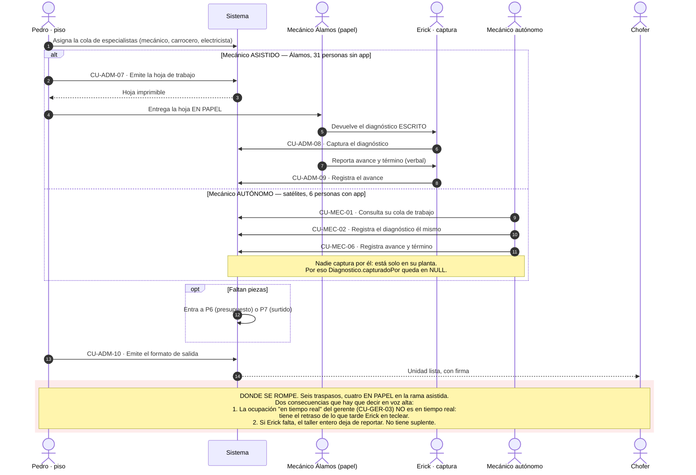

---

## P6 — Presupuesto y autorización del gasto

**Disparador:** el mecánico detecta que faltan piezas.
**Dueño:** Erick · **Traspasos:** **6** · **Casos de uso:** CU-ADM-17, CU-ADM-18, CU-ADM-19, CU-GER-08

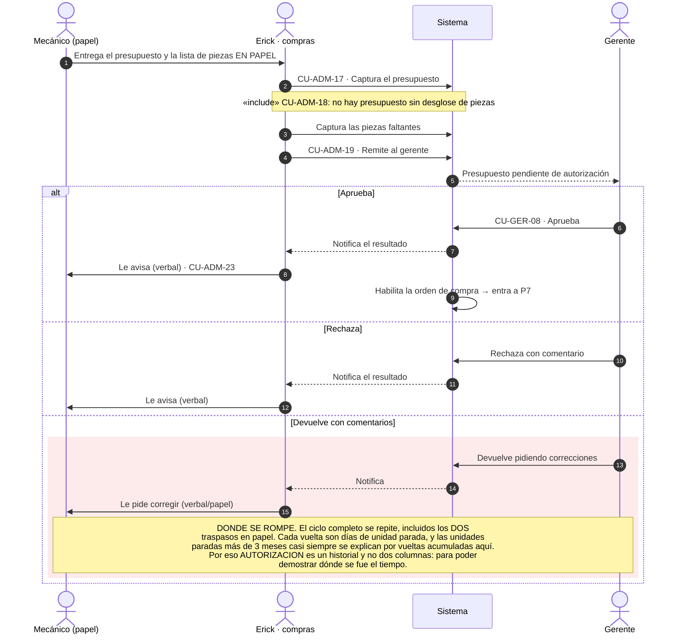

---

## P7 — Compra y abasto de piezas

**Disparador:** presupuesto aprobado, o el mecánico satélite pide una pieza.
**Dueño:** Erick · **Traspasos:** 5 · **Casos de uso:** CU-ADM-20, CU-ADM-21, CU-ADM-22, CU-MEC-03/04/05, CU-GER-05

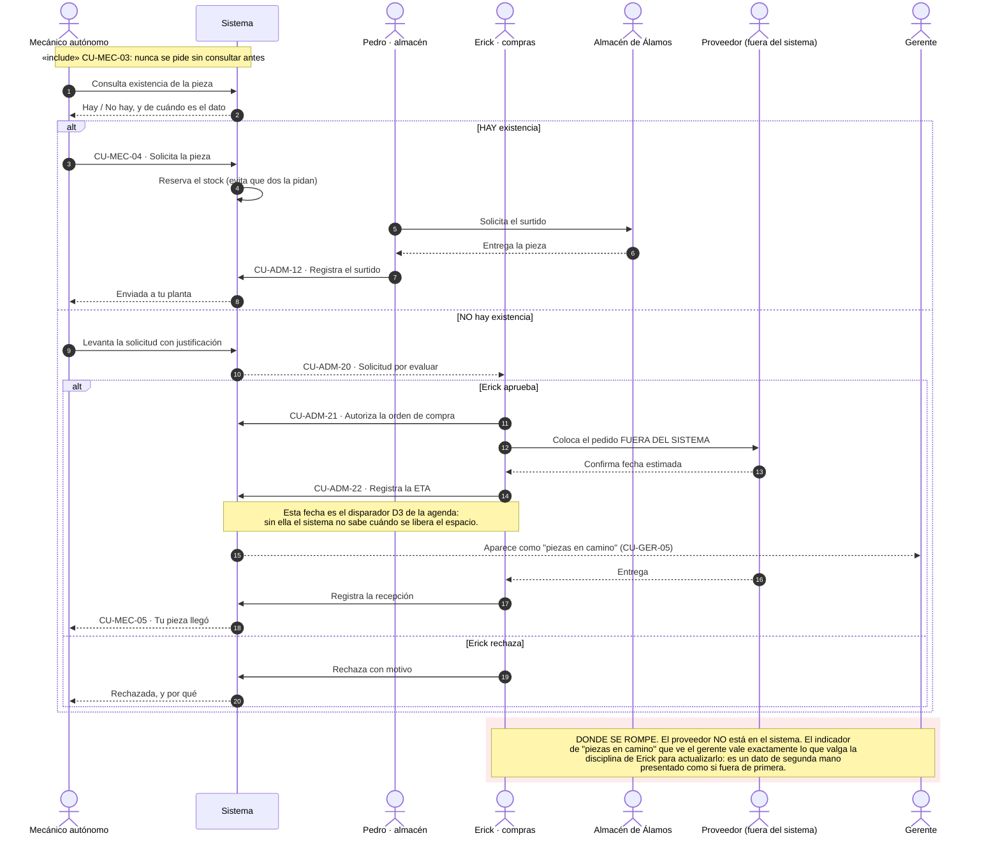

---

## P8 — Atención de avería en ruta

**Disparador:** la unidad se detiene fuera de las instalaciones.
**Dueño:** Chofer poseedor · **Traspasos:** 4 · **Casos de uso:** CU-CHO-11 a CU-CHO-16, CU-MEC-07/08/09, CU-SUP-06/07

> **v2.0 — el auxilio se difunde, no se asigna.** Es el mecanismo más original del sistema.

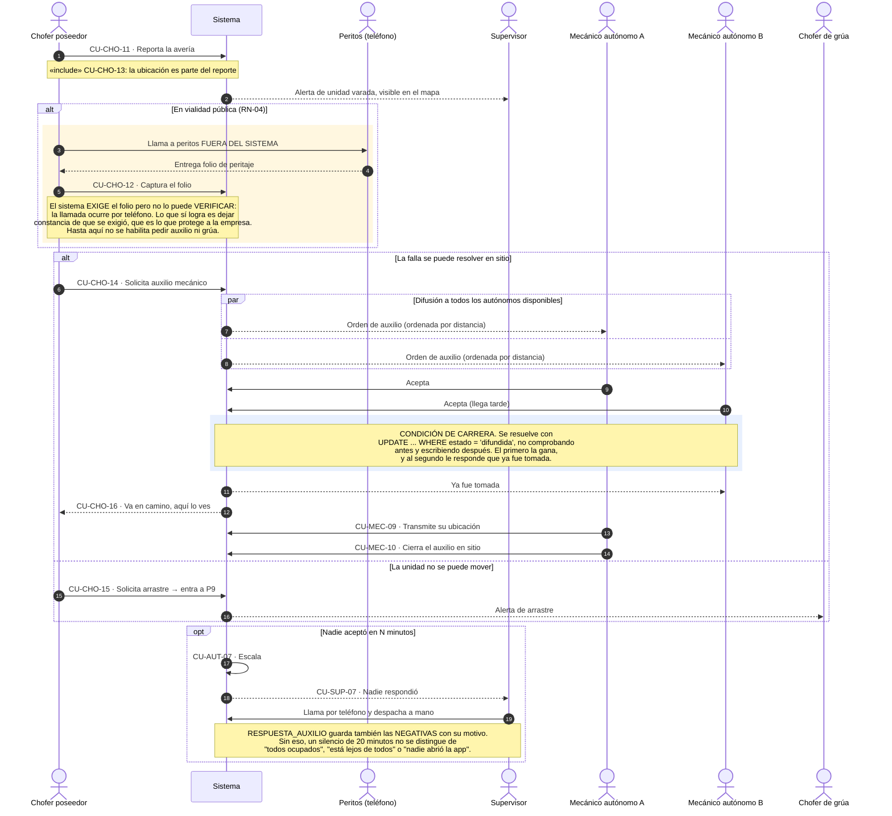

---

## P9 — Arrastre y traslado a taller

**Disparador:** la unidad varada no puede moverse por su cuenta.
**Dueño:** Chofer de grúa · **Traspasos:** 5 · **Casos de uso:** CU-MON-01 a CU-MON-07

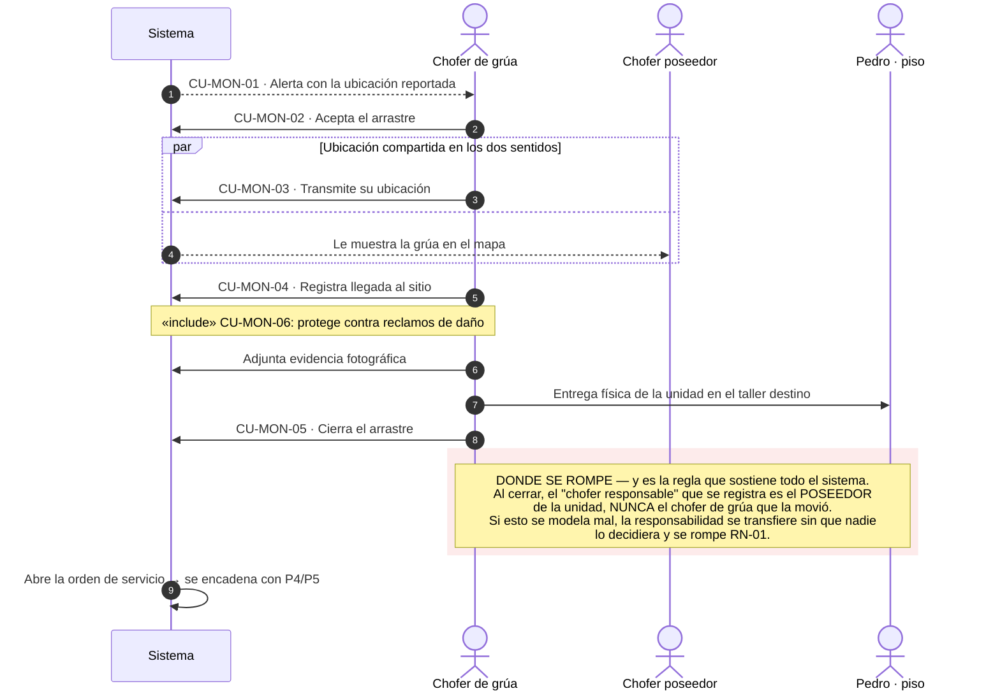

---

## P10 — Atención de incumplimiento de mantenimiento

**Disparador:** el chofer no se presentó a una cita **confirmada**.
**Dueño:** Gerente · **Traspasos:** 3 · **Casos de uso:** CU-AUT-01, CU-GER-10, CU-ADM-24

> **v2.0 — no es un proceso de castigo.** El sistema **avisa**; el trato con el chofer ocurre en
> persona y fuera de la aplicación. **No debe llamarse «penalización» en la interfaz.**

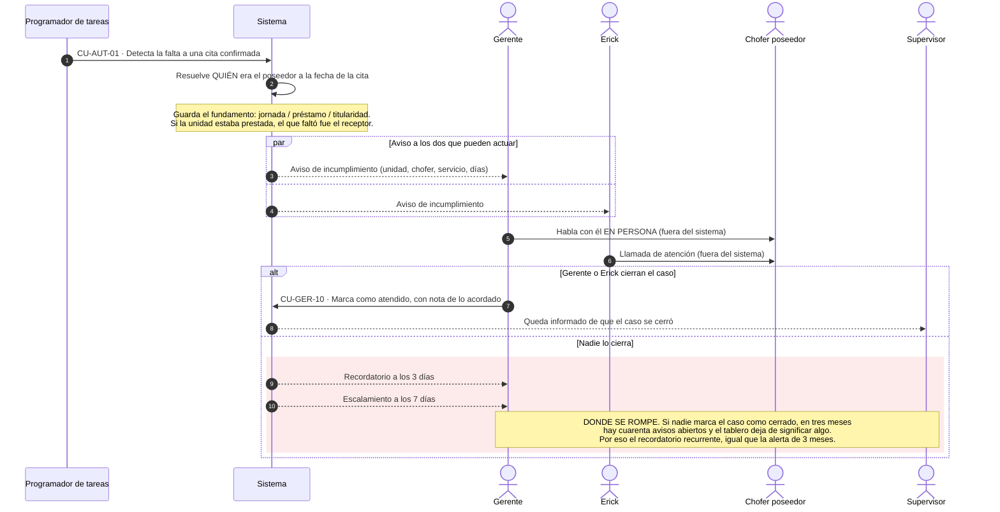

---

## P11 — Control gerencial e indicadores

**Disparador:** continuo, más alertas automáticas.
**Dueño:** Gerente · **Traspasos:** 2 · **Casos de uso:** CU-GER-01 a CU-GER-09, CU-AUT-02

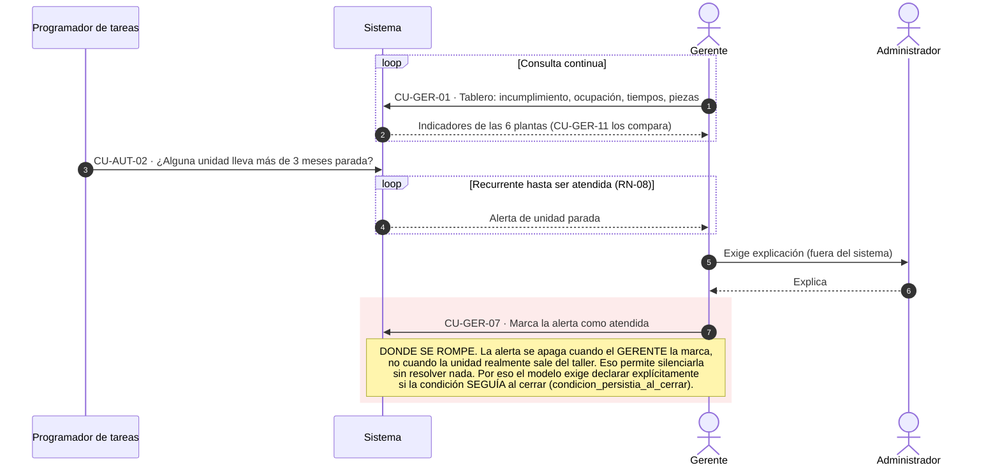

---

## P12 — Administración de datos maestros

**Disparador:** alta o cambio en la organización.
**Dueño:** *sin dueño único — ese es el problema* · **Traspasos:** 0 · **Casos de uso:** CU-GEN-03, CU-ADM-03

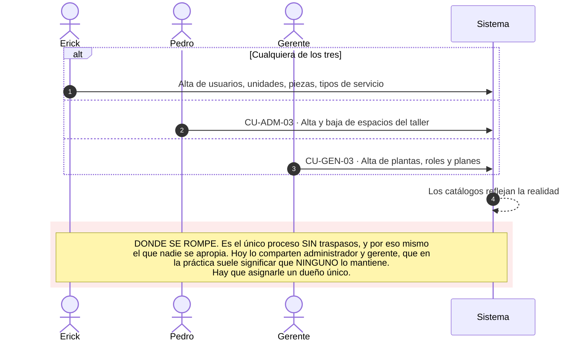

---

## Cómo se encadenan

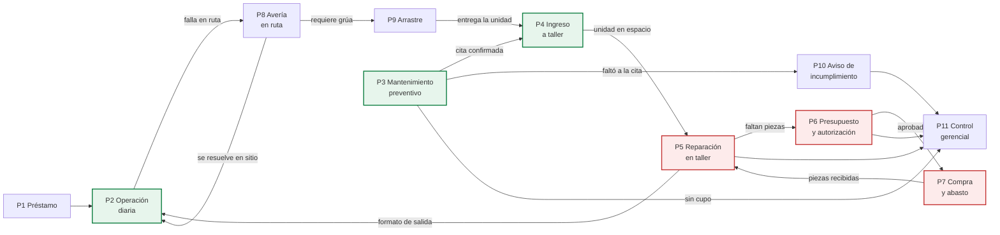

**Hay dos ciclos y los dos importan.**

El **ciclo sano** (verde) `P2 → P3 → P4 → P5 → P2`: la unidad opera, se mantiene, vuelve a operar.

El **ciclo caro** (rojo) `P5 → P6 → P7 → P5`: cada vuelta suma días de unidad parada. Cuando gira
más de dos o tres veces, la unidad termina disparando la alerta de los 3 meses. Y los datos reales
lo confirman: de las 869 reparaciones medidas en el Excel del taller, **el 7% pasó de 90 días**, y
hoy hay **18 unidades** en ese rango.

---

## 13. Dónde estos diagramas se apartan de `procesos.md`

`procesos.md` está en v1.1 y `casos-de-uso.md` en v2.0. Estas son las tres diferencias, y en las
tres seguí a la v2.0 porque es lo que el código implementa:

| # | `procesos.md` v1.1 dice | Estos diagramas muestran | Por qué |
|---|---|---|---|
| 1 | «Los mecánicos no usan la aplicación» | **P5 y P7** tienen rama para el **mecánico autónomo** | La v2.0 devolvió el módulo Mecánico para los 6 de las satélites. Están solos en su planta y nadie captura por ellos |
| 2 | **P10 «Penalización»** en el inventario §2 y en el mapa §5 | **P10 «Aviso de incumplimiento»** | El §4 del propio documento ya lo reescribió; lo que quedó viejo es el título y el diagrama. No hay penalización |
| 3 | **P8** despacha el auxilio por el supervisor | **P8** lo **difunde** a todos los autónomos, y el primero que acepta lo gana | Mecanismo nuevo de la v2.0, con `DIFUSION_AUXILIO` y `RESPUESTA_AUXILIO` |

Además, `procesos.md` §4 numera los casos de uso con la numeración vieja: P5 cita `CU-ADM-14/15` y
P6 cita `CU-ADM-12/13`, que en la v2.0 significan otra cosa. Aquí van con la numeración de
`casos-de-uso.md` v2.0.

**Sugerencia:** subir `procesos.md` a v2.0 con estos tres cambios. Es media hora y evita que
alguien defienda el proyecto con el mapa equivocado.
