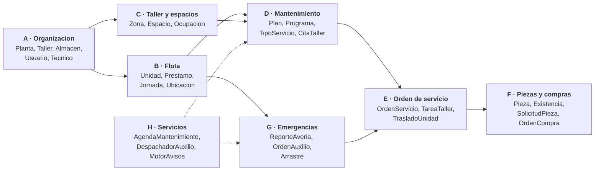
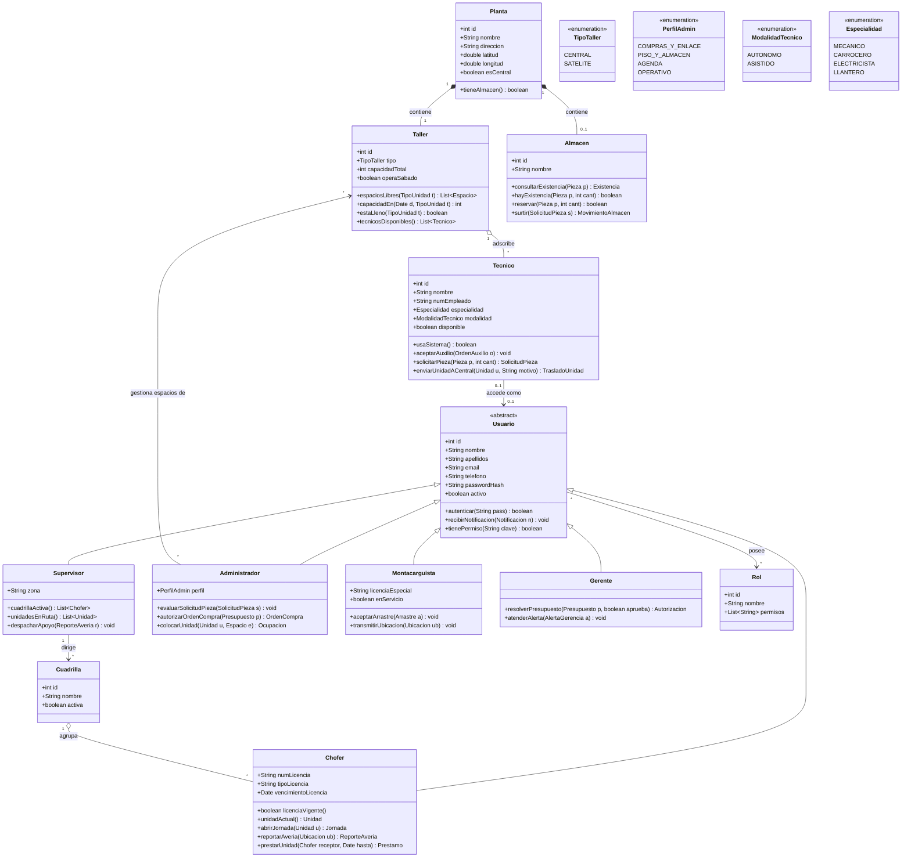
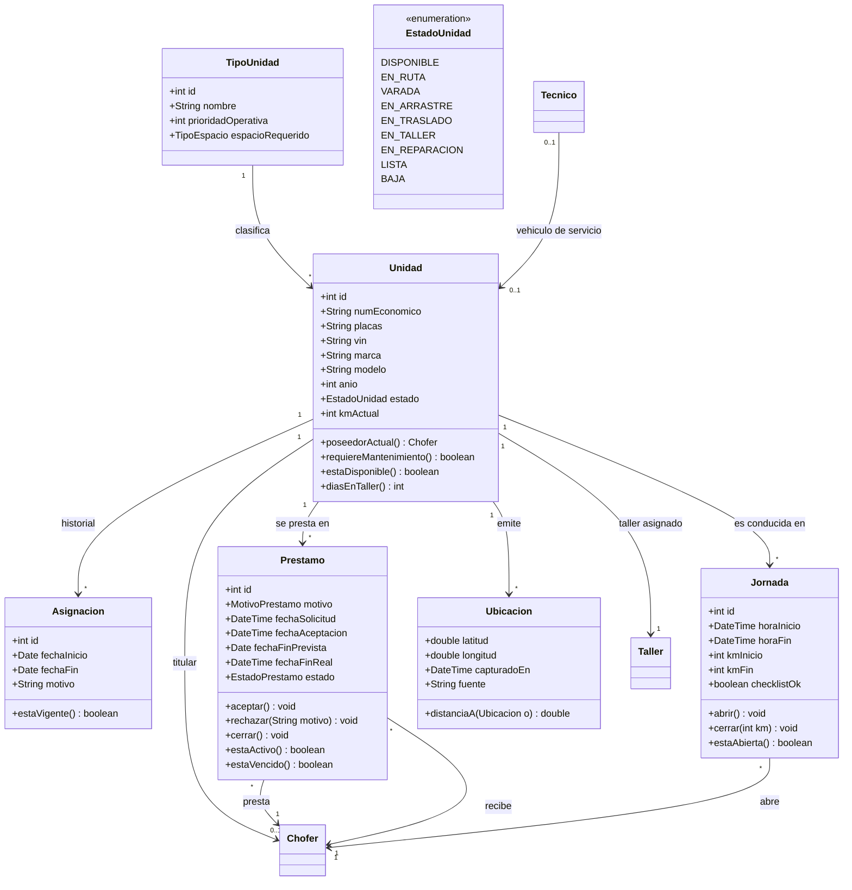
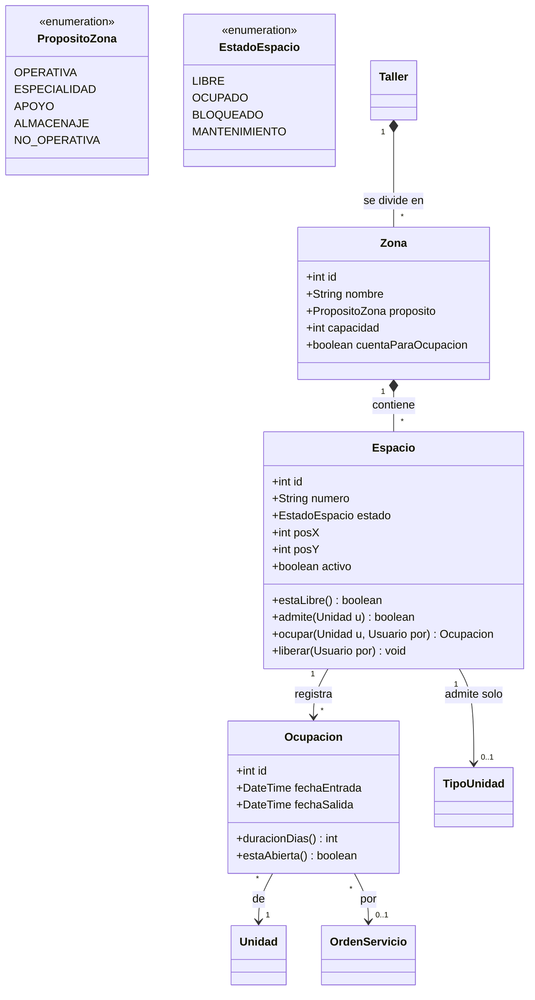
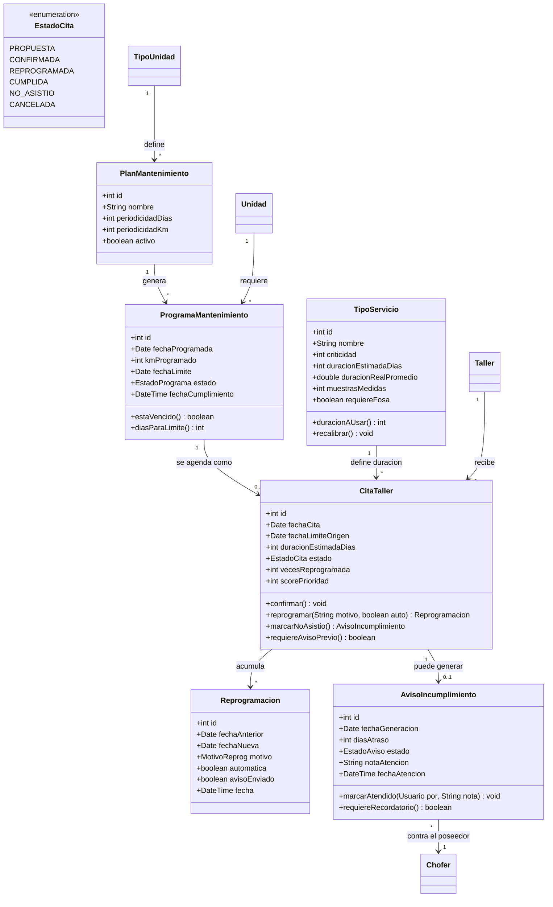
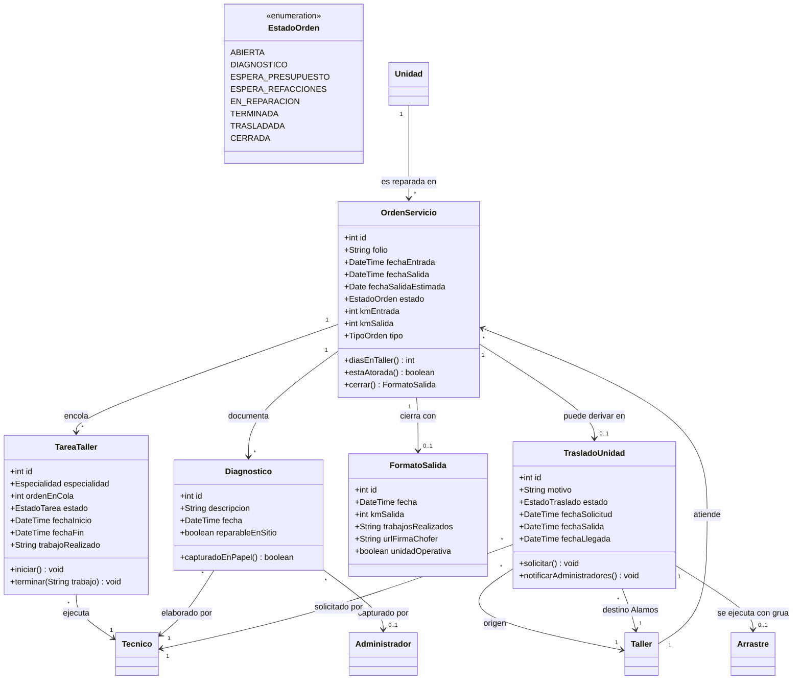
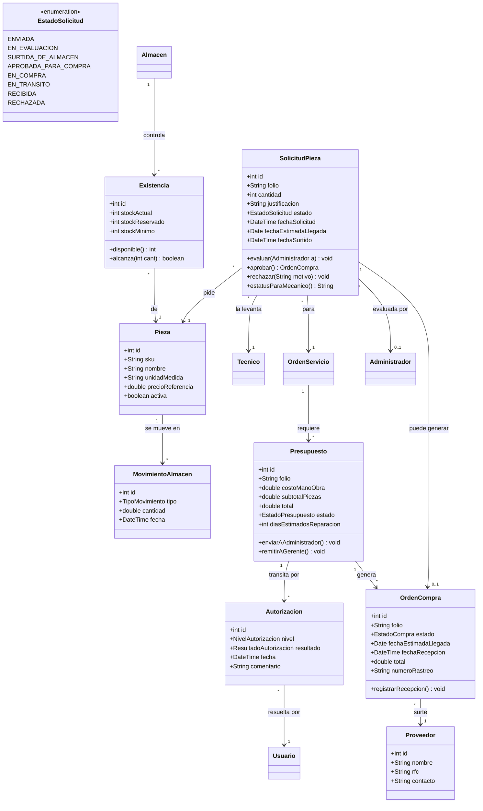
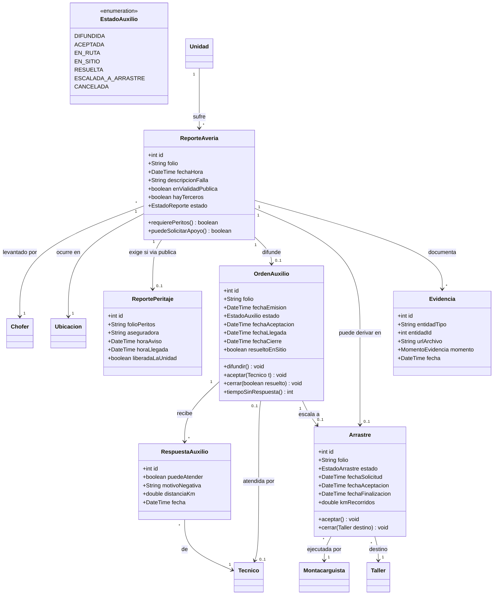
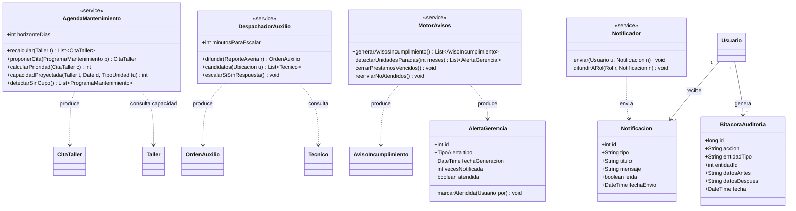

# Diagrama de clases — Sistema de Gestión de Flota y Taller (Baja Gas)

**Versión:** 2.0 · **Fecha:** 2026-08-15
**Sustituye a:** [modelo-er.md](modelo-er.md) v1.1 como modelo de referencia
**Relacionados:** [procesos.md](procesos.md) · [agenda-mantenimiento.md](agenda-mantenimiento.md) · [casos-de-uso.md](casos-de-uso.md)

---

## 0. Qué cambió en la v2.0 y por qué importa

| # | Cambio | Impacto |
|---|---|---|
| 1 | **La empresa tiene 6 plantas, cada una con su taller.** Álamos (central) + Tecate, Rosarito, Guaycura, Carranza y Valle Redondo (satélites) | El sistema pasa de mono-taller a **multi-planta**. Es el cambio más grande |
| 2 | **Los mecánicos de las satélites SÍ usan la aplicación.** Están solos en su planta y nadie captura por ellos | Revierte parcialmente la v1.1: vuelve el módulo Mecánico, pero **solo para ellos** |
| 3 | **Los mecánicos satélite tienen vehículo propio** y atienden unidades varadas en su zona | Nueva clase `OrdenAuxilio` con patrón de difusión y toma |
| 4 | **Cada unidad tiene un taller asignado** al que va si se vara | `Unidad.tallerAsignado` |
| 5 | **La responsabilidad sigue a quien conduce en ese momento** | Precisa RN-01, ver §3.2 |
| 6 | **Un mecánico satélite puede consultar el almacén de Álamos** y pedir piezas | Nuevas clases `Existencia` y `SolicitudPieza` |
| 7 | **Un mecánico satélite puede mandar la unidad a Álamos** si no la puede reparar | Nueva clase `TrasladoUnidad`, con grúa y reporte a administradores |
| 8 | **No se conocen las duraciones de servicio** | Rediseño parcial de la agenda, ver §9 |

### Los dos tipos de mecánico

Esta es la distinción que sostiene todo el modelo nuevo:

| | **Mecánico asistido** (Álamos) | **Mecánico autónomo** (satélites) |
|---|---|---|
| ¿Usa la app? | **No** | **Sí** |
| Quién captura su trabajo | Erick, en papel | Él mismo |
| Quién le asigna trabajo | Pedro | Él mismo / la cola de su taller |
| Vehículo de servicio | No | **Sí**, atiende unidades varadas |
| Pide piezas | Vía Pedro/Erick | **Directo al almacén de Álamos** |

**El modelo ya lo soportaba sin rehacer nada.** En la v1.1 dejé `Tecnico` como catálogo
independiente y anoté que si algún técnico recibía acceso se agregaba una asociación **opcional**
hacia `Usuario`. Eso es exactamente lo que pasó: los autónomos tienen `Usuario`, los asistidos no.
La alternativa —crear usuarios ficticios sin contraseña para los de Álamos— habría ensuciado la
tabla de usuarios y las estadísticas de acceso.

---

## 1. Vista general por paquetes



**8 paquetes · 41 clases.** Cada paquete se puede implementar por separado; las flechas marcan
dependencia, no herencia.

---

## 2. Paquete A — Organización y personas



### Decisiones de este paquete

**`Planta` compone a `Taller` y a `Almacen`, con multiplicidad `0..1` en el almacén.** Esa
multiplicidad no es un detalle: dice en el diagrama que **solo Álamos tiene almacén**, sin
necesidad de una nota al margen. Es composición (`*--`) porque si se cierra una planta, su taller
y su almacén desaparecen con ella.

**`Tecnico` NO hereda de `Usuario`.** Se asocia con `0..1`. Los cinco mecánicos autónomos tienen
`Usuario`; los de Álamos tienen `null` y nunca inician sesión. Si mañana Baja Gas le da app a un
mecánico de Álamos, se crea su `Usuario` y se enlaza — cero cambios de esquema.

**`Administrador` se asocia a varios `Taller`.** Es la consecuencia de tu propuesta de que los
administradores asignen los espacios también de las satélites.

> **Una preocupación que te dejo por escrito, y sigo con tu decisión:** Pedro estaría asignando
> espacios de seis talleres que no ve. El único que está físicamente en Tecate es el mecánico de
> Tecate. Si en la práctica el mecánico acaba avisándole a Pedro por WhatsApp para que mueva un
> bloque en la pantalla, conviene que el mecánico satélite pueda ocupar y liberar los espacios de
> **su propio** taller, y el administrador conserve el alta de espacios y la supervisión. Lo dejo
> modelado como lo pediste; el cambio sería solo agregar la asociación `Tecnico --> Espacio`.

---

## 3. Paquete B — Flota y responsabilidad



### 3.1 `Unidad.tallerAsignado` — nuevo

Cada unidad sabe a qué taller pertenece. Es lo que permite que, cuando se vara, el sistema sepa a
dónde debería ir y qué mecánico es el "natural" para atenderla. **No es una restricción rígida:**
el despachador de auxilio (§8) difunde a todos los mecánicos, no solo al de su taller, porque la
unidad puede estar varada del otro lado de la ciudad.

### 3.2 `poseedorActual()` — la regla se volvió más precisa

Dijiste que la responsabilidad depende de **quién está conduciendo en ese momento**. Eso resuelve
una ambigüedad que arrastraba el modelo. La operación evalúa en este orden:

```
poseedorActual():
    1. si hay una Jornada ABIERTA sobre esta unidad  → el chofer de esa jornada
    2. si no, si hay un Prestamo ACTIVO              → el chofer que recibió
    3. si no                                          → el titular
```

**Por qué la jornada gana sobre el préstamo:** si el titular presta la unidad pero al día
siguiente él mismo la conduce, el responsable de ese día es él, no el receptor del préstamo. El
préstamo define la responsabilidad *de base*; la jornada define la responsabilidad *del momento*.

Esto tiene una consecuencia práctica que conviene decir: **la operación es derivada, no un campo
almacenado.** Guardar `poseedor_chofer_id` como columna obligaría a actualizarlo en tres eventos
distintos y tarde o temprano quedaría desincronizado. Se calcula. Si el rendimiento lo exige
después, se agrega como campo materializado con un trigger — pero no antes de necesitarlo.

---

## 4. Paquete C — Taller y espacios



`Zona.cuentaParaOcupacion` sigue siendo la bandera que evita que el yonke y el área de lavado
inflen el indicador del gerente. En las satélites, que son talleres chicos, probablemente haya una
sola zona con dos o tres espacios — el modelo lo soporta sin cambios.

---

## 5. Paquete D — Mantenimiento y agenda



---

## 6. Paquete E — Orden de servicio y traslados



### `Diagnostico` con dos responsables

`Diagnostico` apunta a un `Tecnico` (quien lo hizo) y **opcionalmente** a un `Administrador`
(quien lo tecleó). Cuando el mecánico es autónomo, el segundo es `null` porque él mismo lo
capturó. Cuando es de Álamos, ahí queda registrado que Erick lo transcribió. Es la forma de saber,
meses después, si un dato es de primera o de segunda mano.

### `TrasladoUnidad` reutiliza `Arrastre`

Cuando el mecánico de Tecate no puede reparar una unidad, la manda a Álamos **con grúa**. Eso ya
es un arrastre: mismo montacarguista, misma ubicación en tiempo real, misma evidencia. No se
duplica la clase; `TrasladoUnidad` la referencia y agrega lo suyo (motivo técnico, taller origen,
reporte a administradores).

---

## 7. Paquete F — Piezas, almacén y compras



### El flujo de la pieza como lo describiste

```
Mecanico → Almacen.consultarExistencia(pieza)
   ├── HAY  → SolicitudPieza(estado = SURTIDA_DE_ALMACEN) → se envía a la planta
   └── NO HAY → SolicitudPieza(estado = ENVIADA)
                    → llega a los perfiles Administrador
                    → Administrador.evaluar()
                         ├── aprueba → OrdenCompra → EN_COMPRA → EN_TRANSITO → RECIBIDA
                         └── rechaza → RECHAZADA con motivo
```

`SolicitudPieza.estatusParaMecanico()` es la operación que responde justo lo que pediste: **si ya
llegó, si está en proceso, o cuándo llega**. Devuelve el estado en lenguaje del mecánico más
`fechaEstimadaLlegada` cuando existe.

**Nota sobre `Existencia`:** el stock no es un campo de `Pieza`, es una clase asociativa entre
`Almacen` y `Pieza`. Hoy solo hay un almacén (Álamos), así que parecería innecesario — pero si
mañana Guaycura guarda sus propios filtros, el modelo ya lo soporta. Poner `stock` dentro de
`Pieza` es el atajo que obliga a rehacer el módulo completo cuando aparece el segundo almacén.

**`stockReservado`** evita el problema clásico: dos mecánicos consultan el mismo filtro, ambos ven
"sí hay", ambos lo piden, solo hay uno. Al crear la solicitud se reserva.

---

## 8. Paquete G — Emergencias y auxilio en carretera

Aquí está el mecanismo nuevo que describiste: el chofer marca su ubicación y la orden **se difunde
a todos los mecánicos**, que deciden según su zona y su carga.



### Por qué existe `RespuestaAuxilio`

Podrías difundir la orden y quedarte solo con quien acepta. Pero entonces **no sabrías nada de los
que no aceptaron**: si nadie responde en 20 minutos, ¿es que están ocupados, que la unidad está
lejos de todos, o que nadie abrió la app?

`RespuestaAuxilio` guarda también las negativas con su motivo y la distancia calculada. Con eso:

- El supervisor sabe a quién llamar por teléfono cuando el sistema no resuelve.
- Después de unos meses se puede ver qué zonas quedan sin cobertura real de mecánicos, que es una
  decisión de negocio, no de software.
- Si un mecánico rechaza sistemáticamente todo, queda registrado.

### El patrón difusión-y-toma

`OrdenAuxilio.difundir()` notifica a **todos** los `Tecnico` con modalidad `AUTONOMO` y
`disponible = true`. El primero que llama `aceptar()` la gana y el estado pasa a `ACEPTADA`; los
demás dejan de verla como disponible.

Dos detalles que hay que resolver en la implementación:

1. **Condición de carrera.** Dos mecánicos aceptan al mismo tiempo. Se resuelve con una
   actualización condicional (`UPDATE ... WHERE estado = 'DIFUNDIDA'`), no comprobando antes y
   escribiendo después.
2. **Que nadie acepte.** `tiempoSinRespuesta()` alimenta el escalamiento: pasados N minutos se
   notifica al supervisor y se ofrece convertirla en arrastre.

**Ordenamiento de la difusión:** la orden se difunde a todos, pero la lista se muestra ordenada
por distancia calculada desde `Ubicacion` hasta la planta de cada mecánico. Como dijiste, ellos
saben mejor que el sistema si les queda de paso — el sistema sugiere, no impone.

---

## 9. Paquete H — Servicios de dominio

Estas clases no representan cosas del mundo real: representan **lógica que no pertenece a ninguna
entidad en particular**. Sin ellas, el algoritmo de la agenda terminaría metido a la fuerza dentro
de `CitaTaller`, que no debería saber nada de los demás talleres.



---

## 10. Respuestas a las preguntas abiertas, y lo que cambia

### 1. No se sabe cuánto tarda cada servicio — **esto obliga a ajustar la agenda**

Es la respuesta que más impacto tiene. El algoritmo que propuse proyectaba un calendario a 30
días, y proyectar requiere saber cuánto ocupa cada unidad su espacio. Sin ese dato, la proyección
sería inventada.

**No se resuelve esperando a tener el dato: se resuelve haciendo que el sistema lo aprenda.**

`TipoServicio` lleva tres campos para eso:

| Campo | Qué es |
|---|---|
| `duracionEstimadaDias` | El valor con el que se arranca, puesto a ojo por Pedro |
| `duracionRealPromedio` | Lo que el sistema **mide**: `fechaSalida − fechaEntrada` de cada orden cerrada |
| `muestrasMedidas` | Cuántas órdenes ya se midieron |

`duracionAUsar()` devuelve el estimado mientras haya menos de ~10 muestras, y a partir de ahí el
promedio real. `recalibrar()` corre mensualmente.

**Y mientras tanto, la agenda opera en modo degradado:** en vez de prometer fecha exacta, propone
un **rango** ("entre el 18 y el 21 de septiembre") y solo confirma día exacto a 48 h. Es menos
vistoso y mucho más honesto que dar una fecha falsa con dos decimales de precisión aparente.

Lo que sí necesito de Pedro, aunque sea a ojo: **una lista de los tipos de servicio más comunes**
(afinación, cambio de aceite, frenos, llantas, correctivo mayor…). Los días pueden ser una
adivinanza inicial; los nombres no.

### 2. Prioridad — confirmada sin cambios

Orden lexicográfico: criticidad → días respecto al límite → veces reprogramada → prioridad de la
unidad → FIFO.

### 3. Avisos de reprogramación — **48 h y 24 h**

`CitaTaller.requiereAvisoPrevio()` ahora contempla dos hitos. Queda así:

| Momento | Qué pasa |
|---|---|
| A más de 48 h | La cita se puede mover automáticamente, avisando |
| Entre 48 h y 24 h | **Primer aviso** de confirmación al chofer y al supervisor |
| A menos de 24 h | **Segundo aviso**. La cita ya no se mueve sola: requiere que Víctor lo autorice |

### 4. Suplencia de Víctor — **Pablo, Erick o Pedro**

Se modela con `Usuario --> Rol` y vigencia temporal: cualquiera de los tres puede recibir el
perfil `AGENDA` por un rango de fechas. **No hacen falta cuentas compartidas ni código nuevo.**

Queda un hueco: **Erick sigue sin suplente nombrado**, y es el único enlace con el gerente y el
único que captura el papel de Álamos.

### 5. Sábado — **sí opera**

`Taller.operaSabado` es un atributo **por taller**, no global: es probable que Álamos abra sábado
y alguna satélite no. El cálculo de capacidad ya lo consulta.

---

## 11. Lo que sigue

Con el diagrama de clases cerrado, el orden para rearmar el resto es:

| Orden | Diagrama | Por qué en ese lugar |
|---|---|---|
| 1 | **Clases** ✅ | Es la fuente de verdad; todo lo demás se deriva de él |
| 2 | Casos de uso | Vuelve el módulo Mecánico (autónomo) y aparecen los de multi-planta |
| 3 | Contexto / paquetes | Cambia de 5 a 6 módulos y aparecen las 6 plantas |
| 4 | Secuencia | Los tres flujos nuevos: auxilio difundido, solicitud de pieza, traslado a Álamos |
| 5 | Estados | `Unidad` y `SolicitudPieza` ya tienen bastantes estados como para merecerlo |
| 6 | Despliegue | Solo si el proyecto lo pide |

**Sugerencia:** el diagrama de **secuencia del auxilio difundido** es el que más te va a servir en
la exposición. Es el mecanismo más original del sistema y el que peor se entiende leyendo clases.

---

## 12. Preguntas que quedan

1. **¿Los mecánicos satélite pueden ocupar y liberar los espacios de su propio taller?** Lo modelé
   como lo pediste (solo administradores), pero ver §2.
2. **¿Quién cubre a Erick?**
3. **¿Cuáles son los tipos de servicio más comunes?** Sin los nombres, `TipoServicio` queda vacío
   y la agenda no arranca.
4. **¿El mecánico satélite hace presupuesto, o solo pide piezas?** Hoy lo modelé pidiendo piezas
   directo. Si además debe presupuestar mano de obra, entra al flujo de `Presupuesto` y necesita
   aprobación del gerente igual que Álamos.
5. **¿Un mecánico satélite puede atender una unidad de otra planta que se varó en su zona?** El
   modelo lo permite (la difusión va a todos). Confirmar que operativamente está bien.
6. **¿Cuántos espacios tiene cada taller satélite?** Para cargar `Zona` y `Espacio`.
