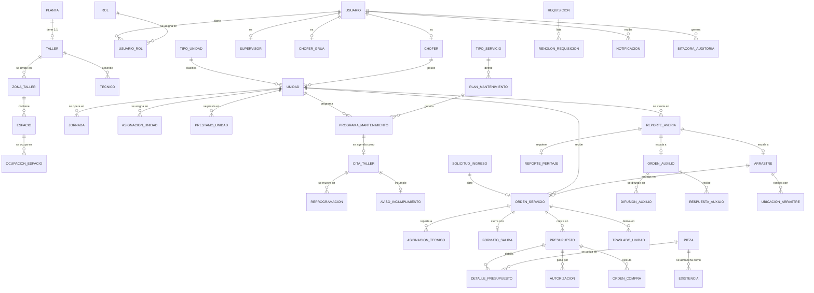
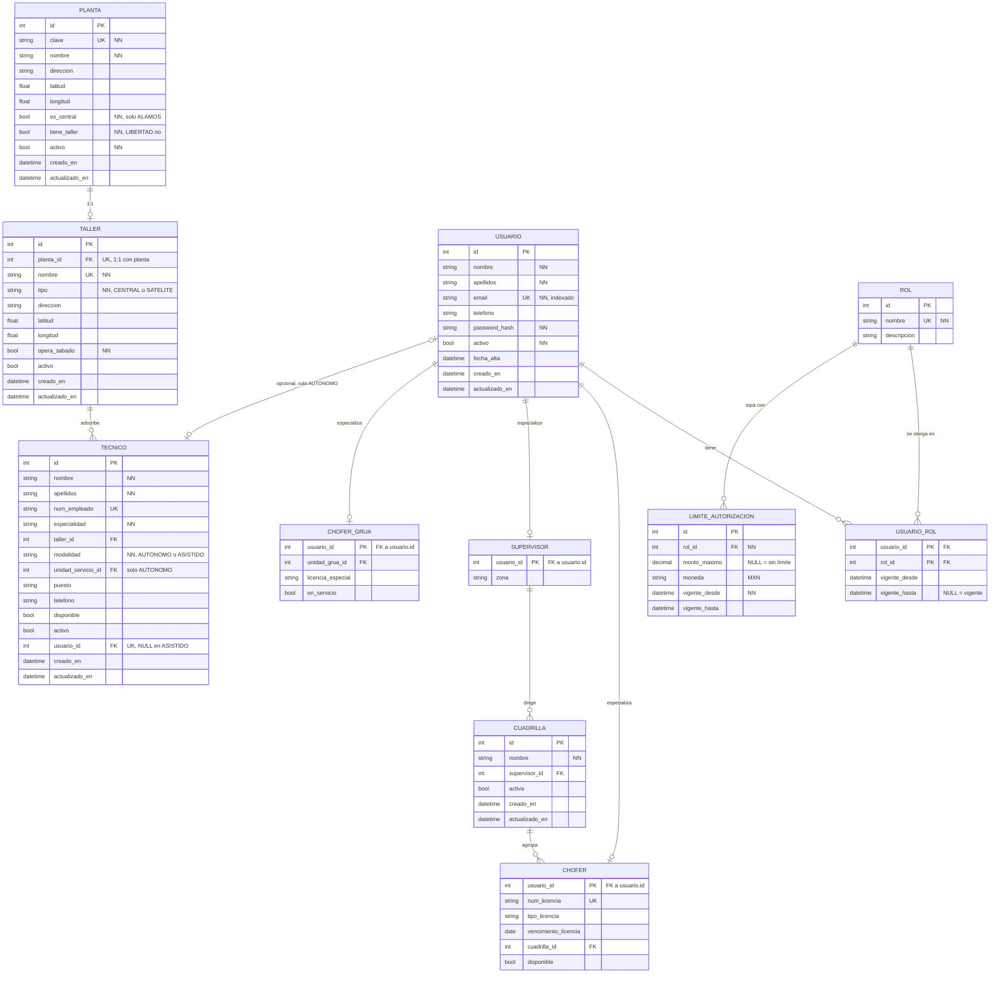
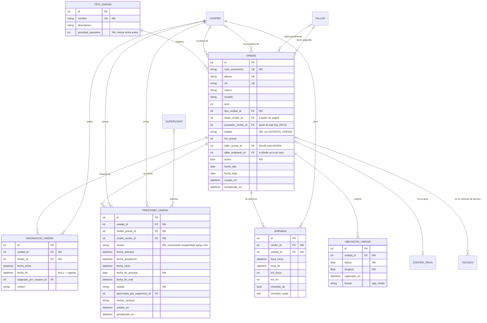
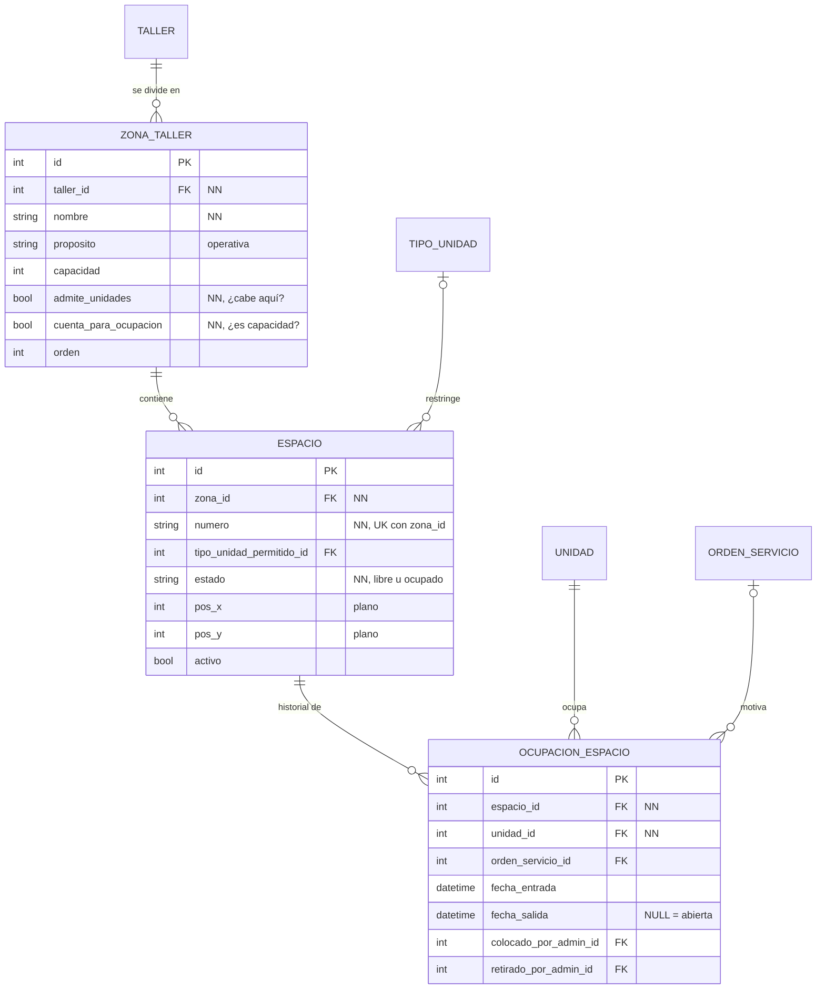
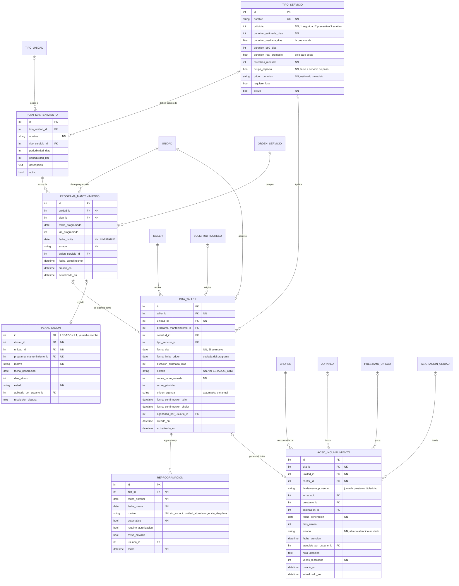
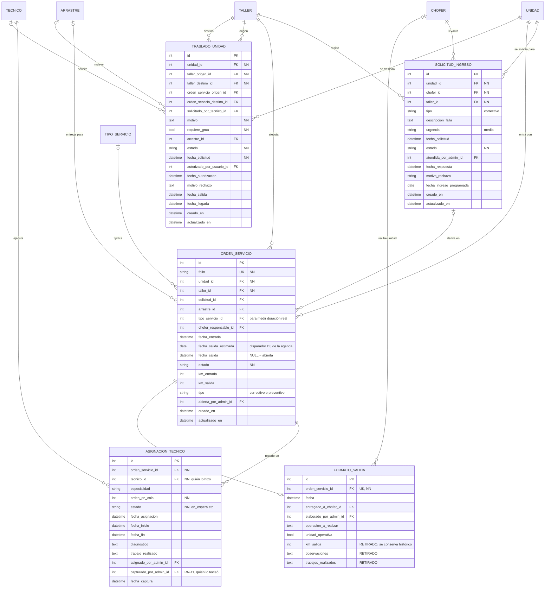
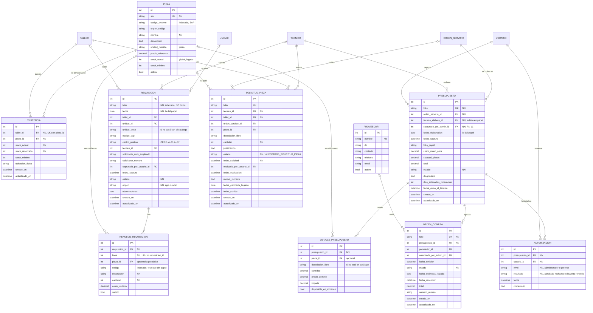
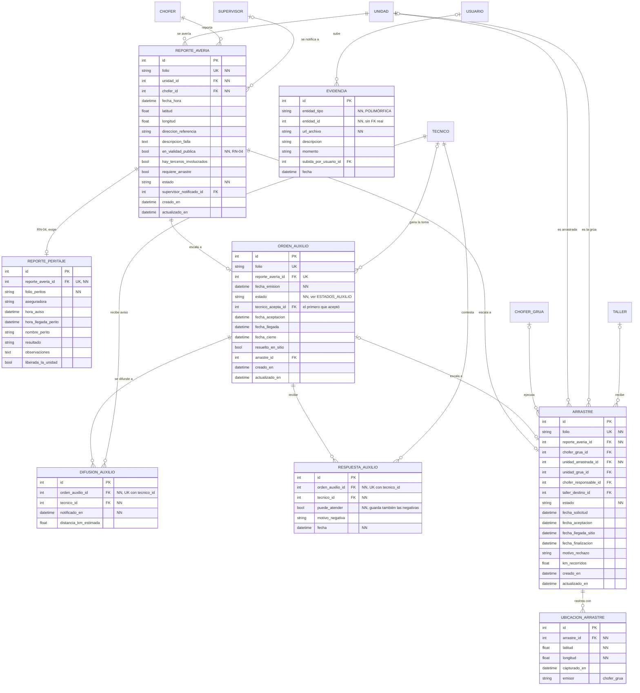
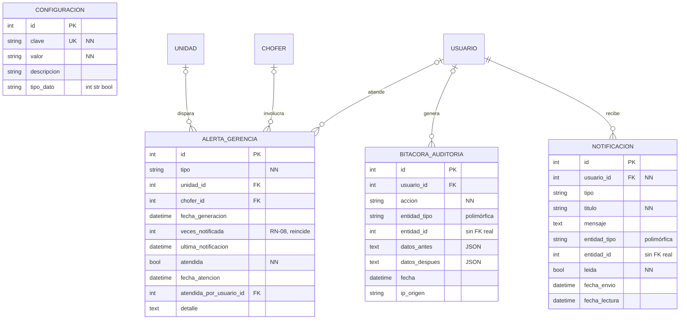
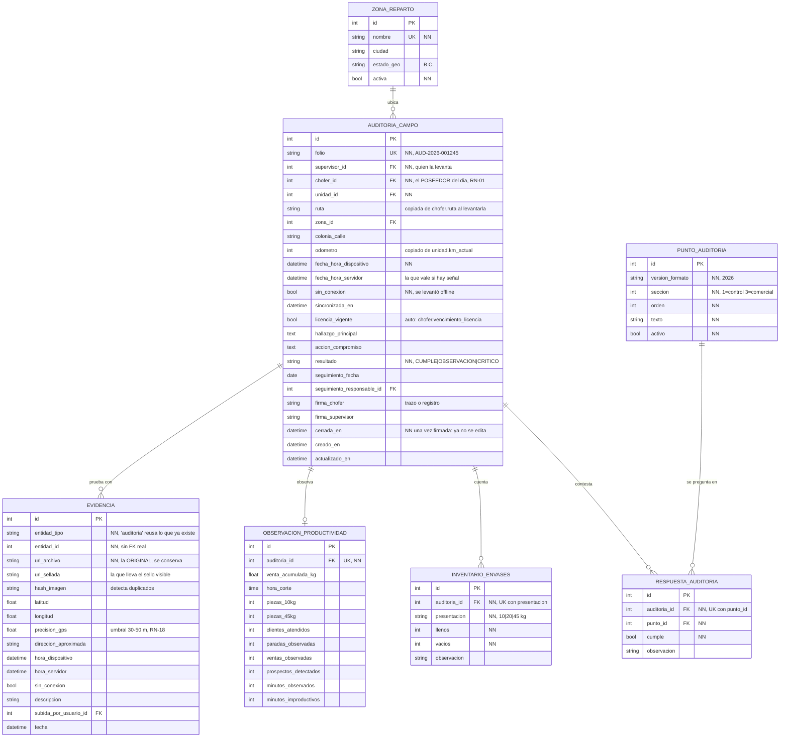

# Modelo ER en Mermaid — derivado del código real

**Fecha:** 2026-08-27
**Fuente de verdad:** las clases SQLAlchemy en `backend/app/modules/*/*_model.py`
(NO `docs/modelo-er.md`, que es el diseño aspiracional de 82 tablas).
**Verificado contra:** `backend/bajagas.db` — 54 tablas, coinciden una a una.

Se divide en 8 diagramas porque 54 tablas en uno solo no se leen. Los paquetes
son los mismos que declara `backend/app/models.py`.

---

## 0. Vista general (sin atributos)

---

## 1. Paquete A — Organización, plantas y personas (11 tablas)

`CHOFER`, `SUPERVISOR` y `CHOFER_GRUA` no tienen `id` propio: su PK **es** la FK
a `USUARIO` (herencia tabla-por-subclase). `TECNICO` sí tiene `id` propio y su
`usuario_id` es opcional a propósito: solo el técnico AUTONOMO tiene cuenta.

---

## 2. Paquete B — Flota y responsabilidad (6 tablas)

La regla que sostiene el módulo: **titular ≠ poseedor**. `titular_chofer_id` es a
quién se le asignó la unidad; `poseedor_chofer_id` es quién la trae hoy (RN-01). Un
préstamo mueve el poseedor, no el titular, y de ahí sale a quién se le reclama un
mantenimiento vencido.

`ESTADOS_UNIDAD` = `disponible · en_ruta · varada · en_arrastre · en_taller ·
en_reparacion · lista · baja`

---

## 3. Paquete C — Taller: zonas, espacios y ocupación (3 tablas)

Las dos banderas de `ZONA_TALLER` no son redundantes y confundirlas rompe la agenda:
`admite_unidades` = ¿cabe físicamente una unidad? · `cuenta_para_ocupacion` = ¿cuenta
como capacidad de reparación? El patio admite unidades pero no es capacidad.

**Índices únicos parciales** (viven en `models.py`, no en la clase, y Mermaid no los
sabe dibujar):

| Índice | Regla que impone |
|---|---|
| `uq_ocupacion_abierta_por_unidad` | una unidad no puede estar en dos espacios a la vez |
| `uq_ocupacion_abierta_por_espacio` | un espacio no puede tener dos unidades a la vez |
| `uq_orden_abierta_por_unidad` | una unidad no puede tener dos órdenes abiertas |

Los tres son `UNIQUE ... WHERE fecha_salida IS NULL`.

---

## 4. Paquete D — Mantenimiento preventivo y agenda (7 tablas)

La separación clave: `PROGRAMA_MANTENIMIENTO.fecha_limite` viene del plan y **nunca**
se mueve (compromiso técnico); `CITA_TALLER.fecha_cita` la asigna la agenda según
capacidad y **sí** se mueve. Por eso el chofer solo incumple si faltó a una cita
confirmada: si el taller nunca pudo dársela, el problema es de capacidad.

`ESTADOS_CITA` = `propuesta · confirmada · reprogramada · cumplida · no_asistio ·
cancelada`

---

## 5. Paquete E — Orden de servicio y traslados (5 tablas)

`ASIGNACION_TECNICO` guarda **dos** responsables por diseño (RN-11): `tecnico_id` es
quien hizo el trabajo, `capturado_por_admin_id` es quien lo tecleó. Los técnicos
ASISTIDO no usan la app.

---

## 6. Paquete F — Piezas, almacén y compras (10 tablas)

Dos caminos distintos que **no** hay que fusionar:

| | `SOLICITUD_PIEZA` | `REQUISICION` |
|---|---|---|
| Qué es | **una** pieza | un **documento** con folio y N renglones |
| Quién la levanta | el mecánico autónomo, desde su teléfono | el capturista, tecleando el papel |
| Quién la pide | el mismo que la levanta | otro; el papel lo firman 3 personas |
| Origen | app | `REQUIS 2026 2.xlsx` |

`ESTADOS_SOLICITUD_PIEZA` = `enviada · en_evaluacion · surtida_de_almacen ·
aprobada_para_compra · en_compra · en_transito · recibida · rechazada`

`ESTADOS_REQUISICION` = `capturada · autorizada · surtida · cancelada`

---

## 7. Paquete G — Averías, auxilio en carretera y arrastre (8 tablas)

`ORDEN_AUXILIO` usa **difusión y toma**: se manda a todos los autónomos disponibles y
el primero que acepta la gana. Por eso hacen falta las dos tablas hijas —
`DIFUSION_AUXILIO` prueba a quién se le avisó, `RESPUESTA_AUXILIO` guarda también las
negativas con su motivo.

`ESTADOS_AUXILIO` = `difundida · aceptada · en_ruta · en_sitio · resuelta ·
escalada_a_arrastre · cancelada`

---

## 8. Paquete H — Transversales (4 tablas)

---

## 9. Paquete I — Auditorías de campo a reparto (6 tablas) · **PROPUESTO**

> **Este paquete no existe todavía en `bajagas.db`.** Es el diseño derivado de los dos documentos
> que entregó el cliente; el análisis y lo que falta decidir están en
> [`auditorias-de-campo.md`](auditorias-de-campo.md). No lo cuentes en el inventario verificado de
> §10 hasta que esté migrado.

Tres decisiones sostienen el diseño:

**El cuestionario es catálogo, no columnas.** Los 18 puntos SÍ/NO de las secciones 1 y 3 del
formato viven en `PUNTO_AUDITORIA` y las respuestas en renglones. Con 18 columnas booleanas, cada
vez que el cliente agregue o quite una pregunta habría que migrar la base — y ese formato dice
«FORMATO 2026» en el encabezado, o sea que ya va por versiones.

**El GPS va en la foto, no en la auditoría.** El documento pide latitud, longitud y precisión
«al momento de la foto», y un supervisor se mueve entre una toma y otra. Ponerlo en la cabecera
mediría dónde empezó la auditoría, no dónde se tomó cada evidencia — que es justo lo que hay que
poder defender. Por eso `EVIDENCIA`, que ya es polimórfica, gana columnas en vez de nacer una
tabla de fotos nueva.

**La productividad va aparte.** La sección 4 del formato está declarada fuera de alcance en
`requerimientos.md` §1 y como Won't en RF-SUP-11. Si el cliente confirma que no entra, se borra
una tabla; si estuviera mezclada en la cabecera, habría que desenredar ocho columnas.

**Restricciones que sostienen el paquete:**

- `UNIQUE(auditoria_id, punto_id)` — una respuesta por pregunta. Sin esto, sincronizar dos veces
  la misma auditoría offline la duplicaría renglón por renglón.
- `UNIQUE(auditoria_id, presentacion)` — un conteo por presentación de envase.
- `UNIQUE(hash_imagen)` **no** va: la misma foto puede aparecer legítimamente en dos auditorías
  distintas. El hash sirve para *detectar* el caso y revisarlo, no para impedirlo.
- **Una auditoría con `cerrada_en` no se reescribe.** Misma regla que el formato de mantenimiento
  (CU-ADM-29): un papel firmado editado sin rastro deja de servir como prueba. Para corregir, se
  levanta otra.
- `resultado` y `precision_gps` son obligatorios antes de cerrar. Una auditoría sin precisión GPS
  registrada no prueba dónde se levantó.

---

## 10. Inventario verificado

| Paquete | Tablas | Módulo |
|---|---|---|
| A · Organización, plantas y personas | 11 | `modules/organizacion/` |
| B · Flota y responsabilidad | 6 | `modules/flota/` |
| C · Taller, zonas y espacios | 3 | `modules/taller/` |
| D · Mantenimiento y agenda | 7 | `modules/mantenimiento/` |
| E · Órdenes de servicio y traslados | 5 | `modules/ordenes/` |
| F · Piezas, almacén y compras | 10 | `modules/piezas/` |
| G · Emergencias, auxilio y arrastre | 8 | `modules/emergencias/` |
| H · Transversales | 4 | `modules/sistema/` |
| **Total** | **54** | coincide con `bajagas.db` |

| Paquete | Tablas | Estado |
|---|---|---|
| I · Auditorías de campo a reparto | 6 | **Propuesto**, §9. No está en la base ni cuenta en el total |
