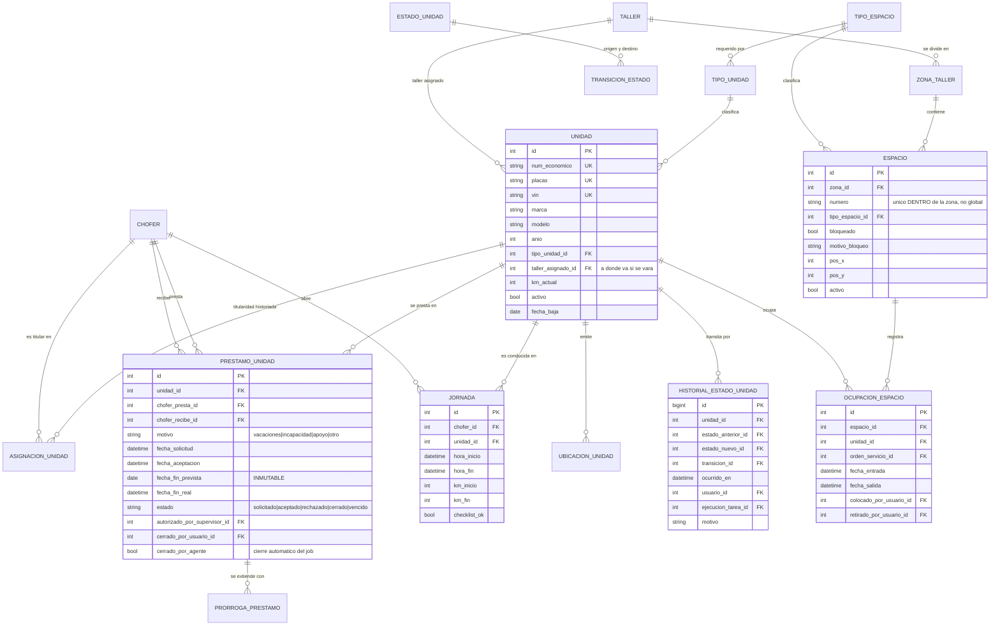
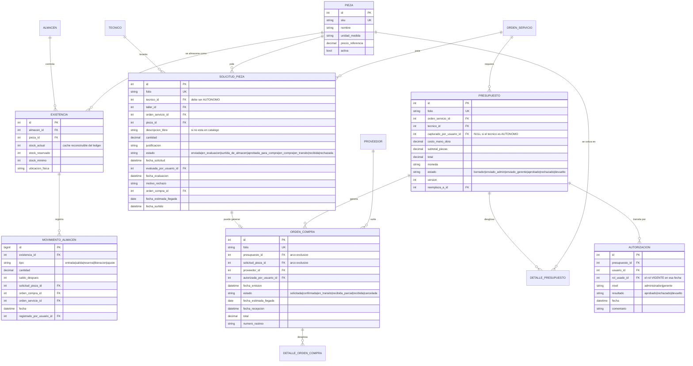

# Modelo Entidad–Relación — Sistema de Gestión de Flota y Taller (Baja Gas)

**Versión:** 2.0 · **Fecha:** 2026-08-15
**Deriva de:** [modelo-clases.md](modelo-clases.md) v2.0 (fuente de verdad)
**Relacionados:** [requerimientos.md](requerimientos.md) · [procesos.md](procesos.md) · [agenda-mantenimiento.md](agenda-mantenimiento.md) · [casos-de-uso.md](casos-de-uso.md)

> **v2.0 — Reescritura completa.** La v1.1 modelaba un solo taller, sin plantas, sin mecánicos
> con acceso, sin agenda y con penalización automática. Nada de eso sigue vigente. Este documento
> la reemplaza por entero.

---

## 0. Cómo se construyó este modelo, y qué tan verificado está

El diseño se repartió en cinco áreas, cada una revisada por tres revisores independientes con
lentes distintas (normalización y llaves, cobertura funcional, contradicciones contra el diagrama
de clases). No todo alcanzó el mismo nivel de verificación, y conviene que lo sepas antes de
defenderlo:

| Área | Diseñada | Verificada | Nivel de confianza |
|---|---|---|---|
| A · Organización y personas | Sí | **Sí, 3 lentes — 34 hallazgos** | Alto: las correcciones ya están aplicadas |
| B–C · Flota, taller y espacios | Sí | No | Medio |
| D–E · Mantenimiento, agenda y órdenes | Sí | No | Medio |
| F–G · Piezas, compras y emergencias | **Escrita a mano** | No | Medio-bajo: es la que más conviene revisar |
| H · Transversales | Sí | No | Medio |

Las áreas sin verificar están diseñadas con el mismo criterio, pero nadie las atacó buscando
defectos. Si vas a llevar esto a implementación, el área F–G es por donde empezaría a revisar.

---

## 1. Convenciones

- **PK** llave primaria · **FK** llave foránea · **UK** única · **NN** obligatoria.
- Toda tabla lleva `creado_en` y `actualizado_en`; no se listan.
- **Tablas de historial: append-only.** Ni `UPDATE` ni `DELETE`. Son las que respaldan
  responsabilidades y autorizaciones; si se pueden reescribir, no prueban nada.
- **Catálogos: borrado lógico** (`activo`). Hay FK desde bitácoras que nunca se borran.
- **Vigencia**, no banderas: las asignaciones de persona a rol, cuadrilla o taller se modelan con
  `vigente_desde` / `vigente_hasta` (rango semiabierto, `NULL` = vigente). Una bandera `activo`
  contesta "¿hoy?"; una vigencia contesta "¿el 3 de marzo?", que es la pregunta que hace una
  auditoría.
- **Dinero en `DECIMAL`**, nunca `float`. **Tiempos en `TIMESTAMPTZ`**, zona `America/Tijuana`.
- **Atributos derivados no se almacenan** salvo que se declare explícitamente como caché
  reconstruible.

---

## 2. Inventario: 6 áreas, 82 tablas

| Área | Tablas | Fase |
|---|---|---|
| **A** · Organización, plantas y personas | 23 | 0 |
| **B–C** · Flota, responsabilidad, taller y espacios | 14 | 1–2 |
| **D–E** · Mantenimiento, agenda, órdenes y traslados | 13 | 2–3 |
| **F** · Piezas, almacén y compras | 10 | 4 |
| **G** · Emergencias, auxilio y arrastre | 8 | 3 |
| **H** · Transversales | 14 | Todas |

**82 tablas es el modelo completo, no lo que hay que construir primero.** En §10 está el núcleo
mínimo de 26 tablas con el que el prototipo ya demuestra el problema de negocio.

---

## 3. Área A — Organización, plantas y personas

```mermaid
erDiagram
    PLANTA ||--|| TALLER : "contiene"
    PLANTA ||--o| ALMACEN : "contiene"
    TALLER ||--o{ TALLER_HORARIO : "opera segun"
    TALLER ||--o{ TALLER_EXCEPCION : "cierra en"
    USUARIO ||--o{ USUARIO_ROL : "recibe"
    ROL ||--o{ USUARIO_ROL : "se asigna en"
    ROL ||--o{ ROL_PERMISO : "concede"
    PERMISO ||--o{ ROL_PERMISO : "otorgado por"
    ROL ||--o| ROL : "perfil de"
    USUARIO ||--o| CHOFER : "especializa"
    USUARIO ||--o| SUPERVISOR : "especializa"
    USUARIO ||--o| MONTACARGUISTA : "especializa"
    CHOFER ||--o{ LICENCIA_CONDUCIR : "historial de"
    USUARIO ||--o{ ADMINISTRADOR_PLAZA : "ocupa"
    USUARIO ||--o{ ADMINISTRADOR_TALLER : "gestiona"
    TALLER ||--o{ ADMINISTRADOR_TALLER : "es gestionado por"
    ROL ||--o{ LIMITE_AUTORIZACION : "topa en"
    TALLER ||--o{ TECNICO : "adscribe"
    TECNICO ||--o| USUARIO : "accede como"
    TECNICO ||--o{ TECNICO_ESPECIALIDAD : "domina"
    ESPECIALIDAD ||--o{ TECNICO_ESPECIALIDAD : "es dominada en"
    CUADRILLA ||--o{ CUADRILLA_SUPERVISOR : "dirigida por"
    CUADRILLA ||--o{ CUADRILLA_MIEMBRO : "integra"
    CHOFER ||--o{ CUADRILLA_MIEMBRO : "pertenece en"

    PLANTA {
        int id PK
        string clave UK "ALAMOS|TECATE|ROSARITO|GUAYCURA|CARRANZA|VALLE_REDONDO"
        string nombre
        string direccion
        decimal latitud "origen del calculo de distancia del auxilio"
        decimal longitud
        bool es_central "solo ALAMOS"
        string zona_horaria "America/Tijuana"
        bool activo
    }
    TALLER {
        int id PK
        int planta_id FK_UK "1:1 con planta"
        string clave UK
        string nombre
        int capacidad_total
        bool activo
    }
    TALLER_HORARIO {
        int id PK
        int taller_id FK
        int dia_semana "0=domingo .. 6=sabado"
        bool opera
        time hora_apertura
        time hora_cierre
    }
    TALLER_EXCEPCION {
        int id PK
        int taller_id FK
        date fecha
        bool opera
        string motivo "dia festivo, inventario, cierre"
    }
    ALMACEN {
        int id PK
        int planta_id FK_UK "0..1 - hoy solo ALAMOS"
        string nombre
        int responsable_usuario_id FK
        bool activo
    }
    USUARIO {
        int id PK
        string nombre
        string apellidos
        string email UK "unico sobre lower(email)"
        string telefono
        string password_hash
        int planta_base_id FK
        bool activo
        datetime fecha_alta
        datetime fecha_baja
    }
    ROL {
        int id PK
        string clave UK "CHOFER|SUPERVISOR|MONTACARGUISTA|GERENTE|ADMIN_COMPRAS|ADMIN_PISO|ADMIN_AGENDA|ADMIN_OPERATIVO|MECANICO_AUTONOMO"
        string nombre
        int rol_padre_id FK "los 4 perfiles admin cuelgan de ADMINISTRADOR"
        bool es_exclusivo_por_ambito "true en los perfiles admin y en GERENTE"
        bool activo
    }
    PERMISO {
        int id PK
        string clave UK "aprobar_presupuesto|autorizar_orden_compra|mover_unidad_espacio|confirmar_cita|..."
        string modulo
        int rol_exclusivo_id FK "permiso indelegable: solo ese rol lo puede tener"
        bool activo
    }
    ROL_PERMISO {
        bigint id PK
        int rol_id FK
        int permiso_id FK
        datetime vigente_desde
        datetime vigente_hasta
        int otorgado_por_usuario_id FK
    }
    USUARIO_ROL {
        bigint id PK
        int usuario_id FK
        int rol_id FK
        int ambito_planta_id FK "NULL = toda la empresa"
        string tipo_asignacion "TITULAR|SUPLENCIA"
        int suple_a_usuario_id FK
        datetime vigente_desde
        datetime vigente_hasta
        int asignado_por_usuario_id FK
    }
    TECNICO {
        int id PK
        string nombre
        string apellidos
        string num_empleado UK
        int taller_id FK
        string modalidad "AUTONOMO|ASISTIDO"
        int usuario_id FK_UK "NOT NULL si AUTONOMO, NULL si ASISTIDO"
        int unidad_servicio_id FK "solo AUTONOMO"
        string telefono
        bool disponible
        bool activo
    }
    LIMITE_AUTORIZACION {
        int id PK
        int rol_id FK
        int ambito_planta_id FK
        decimal monto_maximo "NULL = sin limite"
        string moneda
        datetime vigente_desde
        datetime vigente_hasta
    }
```

*(No se listan todas las columnas de las 23 tablas; el resto —`CHOFER`, `SUPERVISOR`,
`MONTACARGUISTA`, `LICENCIA_CONDUCIR`, `ADMINISTRADOR_PLAZA`, `ADMINISTRADOR_TALLER`,
`ESPECIALIDAD`, `TECNICO_ESPECIALIDAD`, `CUADRILLA`, `CUADRILLA_SUPERVISOR`, `CUADRILLA_MIEMBRO`—
sigue el mismo patrón de vigencia.)*

### Las decisiones del área A que hay que poder defender

**`TECNICO` no cuelga de `USUARIO`: se asocia con `0..1`.** Es la pieza que sostiene la v2.0. Los
cinco mecánicos autónomos tienen `usuario_id`; los de Álamos lo tienen en `NULL` y no pueden
iniciar sesión. *Alternativa descartada:* crear usuarios ficticios sin contraseña para los de
Álamos — ensucia la tabla de usuarios, rompe las estadísticas de acceso y deja cuentas sin dueño.

**La restricción va en los dos sentidos.** `modalidad = 'AUTONOMO'` exige `usuario_id NOT NULL`
**y** `modalidad = 'ASISTIDO'` exige `usuario_id IS NULL`. La verificación encontró que la primera
versión solo tenía la mitad, lo que permitía darle login a un mecánico de Álamos sin que nada
protestara.

**Los 4 perfiles de administrador son roles distintos**, colgados de un rol padre `ADMINISTRADOR`
por auto-referencia. Así se puede notificar "a los administradores" sin perder el permiso fino:
Víctor no debe poder autorizar órdenes de compra y Erick no debe poder mover vehículos de espacio.
*Alternativa descartada:* un solo rol `ADMINISTRADOR` con cuatro usuarios — cualquiera podría
hacer todo, que es justo lo que un sistema de control debe impedir.

**El horario del taller es una tabla, no dos columnas.** `TALLER_HORARIO` por día de la semana más
`TALLER_EXCEPCION` para festivos. Confirmaste que **sí se agenda sábado**, pero es probable que
Álamos abra sábado medio día y alguna satélite no abra: una bandera `opera_sabado` no puede
expresar eso, y la agenda calcula capacidad contra este calendario.

**La suplencia no necesita código nuevo.** `USUARIO_ROL` con vigencia y `tipo_asignacion =
'SUPLENCIA'` cubre lo que confirmaste: a Víctor lo cubren Pablo, Erick o Pedro. Se le da el rol
`ADMIN_AGENDA` con fecha de fin, y se acabó. *Sin cuentas compartidas.*

---

## 4. Área B–C — Flota, responsabilidad, taller y espacios

Es el área que resuelve el problema central del proyecto: **quién responde por cada unidad en cada
momento.**



### El poseedor de la unidad NO es una columna

```
poseedor_actual(unidad):
    1. JORNADA abierta sobre la unidad          → su chofer
    2. si no, PRESTAMO_UNIDAD aceptado y no cerrado → chofer_recibe
    3. si no, ASIGNACION_UNIDAD vigente          → el titular
    4. si no                                      → NULL
```

Se implementa como **función o vista**, nunca como columna. *Alternativa descartada:*
`UNIDAD.poseedor_chofer_id` — obligaría a mantenerla sincronizada en seis eventos distintos
(abrir jornada, cerrarla, aceptar préstamo, cerrarlo, vencerlo, cambiar titularidad), y el día que
se desincronice, el aviso de incumplimiento le llega a la persona equivocada. Ese es exactamente
el dato que no se puede permitir tener mal.

**El estado de la unidad tampoco es una columna.** `HISTORIAL_ESTADO_UNIDAD` es append-only y el
estado actual es su última fila. Además existe `TRANSICION_ESTADO` como catálogo de transiciones
**permitidas**: es lo que impide que una unidad pase de `en_taller` a `en_ruta` sin pasar por
`lista`, sin escribir esa validación a mano en cada endpoint.

### Restricciones que sostienen el área

| ID | Restricción | Implementación |
|---|---|---|
| RI-B-01 | Una unidad tiene a lo más **una titularidad vigente** | Índice único parcial |
| RI-B-03 | Una unidad tiene a lo más **un préstamo activo** | Índice único parcial |
| RI-B-04 | `chofer_presta_id ≠ chofer_recibe_id`, ambos activos y con licencia vigente **a la fecha** | CHECK + trigger contra `LICENCIA_CONDUCIR` |
| RI-B-08 | `fecha_fin_prevista` es **inmutable**; extender es insertar una `PRORROGA_PRESTAMO` | Trigger que rechaza el UPDATE |
| RI-B-10 | No se acepta préstamo sobre unidad en taller, varada, en arrastre o dada de baja | Trigger |
| RI-B-11/12 | Un chofer tiene **una jornada abierta**; una unidad tiene **una jornada abierta** | Dos índices únicos parciales |
| RI-B-15 | `km_inicio` no puede ser menor al último kilometraje conocido (monotonía del odómetro) | Trigger con excepción registrada |
| RI-B-17 | Un punto de ubicación exige contexto abierto: jornada **o** reporte de avería | CHECK + trigger |
| RI-B-20 | Toda ubicación nace con `purgar_despues_de`; hay job de purga | DEFAULT NOT NULL + job |
| RI-B-21 | `numero` de espacio es único **dentro de la zona**, no globalmente | Índice único `(zona_id, numero)` |
| RI-B-22/23 | Un espacio tiene una ocupación abierta; una unidad no está en dos espacios | Índices únicos parciales |
| RI-B-25 | **Compatibilidad física:** el tipo de espacio debe admitir el tipo de unidad | Trigger |
| RI-B-31 | El poseedor **no se almacena**: se resuelve por prelación | Función `poseedor_actual()` |
| RI-B-32 | La capacidad se calcula **por tipo de espacio** y solo sobre zonas con `cuenta_para_ocupacion` | Vista de capacidad |

RI-B-20 no es un detalle técnico: la traza GPS es el único dato personal sensible del sistema y
`RNF-10` exige retención limitada. Si nace sin fecha de purga, nunca se purga.

---

## 5. Área D–E — Mantenimiento, agenda, órdenes y traslados

```mermaid
erDiagram
    TIPO_UNIDAD ||--o{ PLAN_MANTENIMIENTO : "define"
    TIPO_SERVICIO ||--o{ PLAN_MANTENIMIENTO : "es del tipo"
    PLAN_MANTENIMIENTO ||--o{ PROGRAMA_MANTENIMIENTO : "genera"
    UNIDAD ||--o{ PROGRAMA_MANTENIMIENTO : "requiere"
    PROGRAMA_MANTENIMIENTO ||--o| CITA_TALLER : "se agenda como"
    SOLICITUD_INGRESO ||--o| CITA_TALLER : "se agenda como"
    TALLER ||--o{ CITA_TALLER : "recibe"
    CITA_TALLER ||--o{ REPROGRAMACION : "acumula"
    CITA_TALLER ||--o| AVISO_INCUMPLIMIENTO : "puede generar"
    CITA_TALLER ||--o| ORDEN_SERVICIO : "se cumple con"
    UNIDAD ||--o{ ORDEN_SERVICIO : "estancia en taller"
    ORDEN_SERVICIO ||--o{ TAREA_TALLER : "encola"
    TECNICO ||--o{ TAREA_TALLER : "ejecuta"
    ORDEN_SERVICIO ||--o{ DIAGNOSTICO : "documenta"
    TECNICO ||--o{ DIAGNOSTICO : "elabora"
    ORDEN_SERVICIO ||--o| FORMATO_SALIDA : "cierra con"
    ORDEN_SERVICIO ||--o| TRASLADO_UNIDAD : "deriva en"
    ORDEN_SERVICIO ||--o| MEDICION_DURACION : "alimenta"
    TIPO_SERVICIO ||--o{ MEDICION_DURACION : "recalibra con"

    TIPO_SERVICIO {
        int id PK
        string nombre "afinacion|aceite|frenos|llantas|correctivo_mayor|carroceria"
        int criticidad "1=seguridad 2=preventivo 3=estetico"
        int duracion_estimada_dias "valor inicial, puesto a ojo"
        decimal duracion_real_promedio "MEDIDA por el sistema"
        int muestras_medidas
        int tipo_espacio_requerido_id FK
        bool requiere_fosa
    }
    PROGRAMA_MANTENIMIENTO {
        int id PK
        int unidad_id FK
        int plan_id FK
        int num_ciclo "idempotencia del job generador"
        date fecha_programada
        int km_programado
        date fecha_limite "INMUTABLE"
        string estado "pendiente|agendado|cumplido|sin_cupo|cancelado"
        datetime fecha_cumplimiento
        int orden_servicio_cumplimiento_id FK
    }
    CITA_TALLER {
        int id PK
        int taller_id FK
        int unidad_id FK
        int programa_mantenimiento_id FK "arco exclusivo"
        int solicitud_ingreso_id FK "arco exclusivo"
        int tipo_servicio_id FK
        date fecha_cita "SI se mueve"
        date fecha_limite_origen "NO se mueve - copiada del programa"
        int duracion_estimada_dias
        string estado "propuesta|confirmada|reprogramada|cumplida|no_asistio|cancelada"
        int veces_reprogramada
        int score_prioridad
        datetime fecha_confirmacion_taller
        datetime fecha_confirmacion_chofer
        string origen_agenda "automatica|manual"
    }
    AVISO_INCUMPLIMIENTO {
        int id PK
        int cita_id FK_UK
        int chofer_id FK "el POSEEDOR a la fecha de la cita"
        string fundamento_poseedor "jornada|prestamo|titularidad"
        int jornada_id FK
        int prestamo_id FK
        int asignacion_id FK
        date fecha_generacion
        int dias_atraso
        string estado "abierto|atendido|anulado"
        datetime fecha_atencion
        int atendido_por_usuario_id FK
        string nota_atencion
    }
    ORDEN_SERVICIO {
        int id PK
        string folio UK
        int unidad_id FK
        int taller_id FK
        int cita_id FK
        int arrastre_id FK
        datetime fecha_entrada
        date fecha_salida_estimada "dispara el recalculo de la agenda"
        datetime fecha_salida
        string estado "abierta|diagnostico|espera_presupuesto|espera_refacciones|en_reparacion|terminada|trasladada|cerrada|cancelada"
        int km_entrada
        int km_salida
    }
    TAREA_TALLER {
        int id PK
        int orden_servicio_id FK
        int tecnico_id FK
        int especialidad_id FK
        int orden_en_cola "indice unico DIFERIBLE"
        string estado "en_espera|en_proceso|pausada|terminada|cancelada"
        datetime fecha_inicio
        datetime fecha_fin
        string trabajo_realizado
        int capturada_por_usuario_id FK "solo si el tecnico es ASISTIDO"
        datetime fecha_captura
    }
    TRASLADO_UNIDAD {
        int id PK
        int unidad_id FK
        int taller_origen_id FK
        int taller_destino_id FK "debe ser el CENTRAL"
        int solicitado_por_tecnico_id FK "debe ser AUTONOMO"
        int orden_servicio_origen_id FK
        int orden_servicio_destino_id FK
        string motivo
        bool requiere_grua
        int arrastre_id FK
        string estado "solicitado|autorizado|rechazado|en_transito|recibido|cancelado"
    }
```

### Las cuatro reglas que definen esta área

**1. `fecha_limite` es inmutable; `fecha_cita` se mueve.** Un trigger rechaza cualquier `UPDATE`
sobre `PROGRAMA_MANTENIMIENTO.fecha_limite` y sobre `CITA_TALLER.fecha_limite_origen`. Es la regla
que hace justo el sistema: si el taller no pudo dar cita antes del límite, el incumplimiento es del
taller. *Sin esta inmutabilidad, un administrador presionado podría mover el límite y el
indicador del gerente perdería todo significado.*

**2. La duración se aprende.** `MEDICION_DURACION` es append-only, una fila por orden cerrada.
`duracion_a_usar()` devuelve el estimado inicial mientras haya menos de ~10 muestras y el promedio
real después. `MEDICION_DURACION.dias_detenida_espera_refacciones` se descuenta: una unidad parada
tres semanas esperando una pieza no significa que la afinación dure tres semanas.

**3. Doble responsable, pero condicional.** `TAREA_TALLER.capturada_por_usuario_id` y
`DIAGNOSTICO.capturado_por_usuario_id` **solo se llenan cuando el técnico es `ASISTIDO`**. El
mecánico de Tecate captura lo suyo y esa columna queda en `NULL`. Un trigger lo valida contra
`TECNICO.modalidad`. La diferencia entre `fecha_captura` y `fecha_fin` es el indicador del retraso
de captura de Erick — y es un dato que la dirección va a querer ver.

**4. `orden_en_cola` necesita un índice DIFERIBLE.** Reordenar la cola de especialistas viola la
unicidad a mitad de la transacción, aunque al final sea consistente. Con un índice normal, el
reordenamiento simplemente falla. Es un detalle de implementación que tumba la funcionalidad si se
descubre tarde.

---

## 6. Área F — Piezas, almacén y compras

> Área escrita a mano: el agente que la diseñaba murió por límite de sesión. Es la menos verificada
> del modelo.



### Decisiones del área F

**El stock es un libro mayor, no un número.** La verdad vive en `MOVIMIENTO_ALMACEN` (append-only,
con `saldo_despues`); `EXISTENCIA.stock_actual` es un **caché reconstruible** mantenido por
trigger. *Alternativa descartada:* guardar solo `stock_actual` — el día que el número no cuadre
con el anaquel, no hay forma de saber en qué movimiento se descuadró.

**`stock_reservado` no es opcional.** Sin él: el mecánico de Tecate y el de Rosarito consultan el
mismo filtro, ambos ven "sí hay", ambos lo piden, y solo hay uno. Al crear la solicitud se reserva.

**`EXISTENCIA` es una tabla asociativa, no columnas en `PIEZA`.** Hoy hay un solo almacén y parece
sobrar. Pero el propósito declarado es soportar el segundo: si mañana Guaycura guarda sus propios
filtros, poner `stock` dentro de `PIEZA` obliga a rehacer el módulo completo.

**`ORDEN_COMPRA` tiene un arco exclusivo:** viene de un `PRESUPUESTO` **o** de una
`SOLICITUD_PIEZA`, nunca de ambos ni de ninguno. Son los dos caminos reales: la reparación grande
de Álamos que pasa por presupuesto, y la pieza suelta que pide el mecánico satélite.

**`AUTORIZACION.rol_usado_id`** guarda **con qué rol** se aprobó, no solo quién aprobó. Es lo que
permite responder "¿esta persona era gerente el 3 de marzo?" seis meses después, cuando ya cambió
de puesto.

| ID | Restricción | Implementación |
|---|---|---|
| RI-F-01 | `ORDEN_COMPRA` exige exactamente una de (`presupuesto_id`, `solicitud_pieza_id`) | CHECK `num_nonnulls(...) = 1` |
| RI-F-02 | No hay `ORDEN_COMPRA` sin presupuesto **aprobado** o solicitud **aprobada** | Trigger |
| RI-F-03 | Un `PRESUPUESTO` llega a `aprobado` solo con `AUTORIZACION` de nivel gerente cuyo rol estaba **vigente en `fecha`** | Trigger contra `USUARIO_ROL` |
| RI-F-04 | `aprobar_presupuesto` es un permiso **indelegable**: `PERMISO.rol_exclusivo_id = GERENTE` | Trigger sobre `ROL_PERMISO` |
| RI-F-05 | `EXISTENCIA` única por `(almacen_id, pieza_id)` | Índice único |
| RI-F-06 | `0 ≤ stock_reservado ≤ stock_actual` | CHECK |
| RI-F-07 | `SOLICITUD_PIEZA.tecnico_id` debe tener `modalidad = 'AUTONOMO'` | Trigger |
| RI-F-08 | Una solicitud activa por `(orden_servicio_id, pieza_id)` | Índice único parcial |
| RI-F-09 | `MOVIMIENTO_ALMACEN` y `AUTORIZACION` son append-only | Revocación de privilegios + trigger |
| RI-F-10 | `cantidad_recibida ≤ cantidad_solicitada` salvo sobre-recepción marcada | CHECK + bandera |
| RI-F-11 | Todos los montos en `DECIMAL(12,2)`, nunca `float` | Tipo de dato |

---

## 7. Área G — Emergencias, auxilio y arrastre

> También escrita a mano. Contiene el mecanismo más original del sistema: la **difusión y toma**
> de la orden de auxilio.

```mermaid
erDiagram
    UNIDAD ||--o{ REPORTE_AVERIA : "sufre"
    CHOFER ||--o{ REPORTE_AVERIA : "levanta"
    REPORTE_AVERIA ||--o| REPORTE_PERITAJE : "exige si via publica"
    REPORTE_AVERIA ||--o| ORDEN_AUXILIO : "difunde"
    ORDEN_AUXILIO ||--o{ DIFUSION_AUXILIO : "notifica a"
    TECNICO ||--o{ DIFUSION_AUXILIO : "es notificado en"
    ORDEN_AUXILIO ||--o{ RESPUESTA_AUXILIO : "recibe"
    TECNICO ||--o{ RESPUESTA_AUXILIO : "responde"
    ORDEN_AUXILIO ||--o| TECNICO : "aceptada por"
    ORDEN_AUXILIO ||--o| ARRASTRE : "escala a"
    REPORTE_AVERIA ||--o| ARRASTRE : "deriva en"
    TRASLADO_UNIDAD ||--o| ARRASTRE : "se ejecuta con"
    MONTACARGUISTA ||--o{ ARRASTRE : "ejecuta"
    TALLER ||--o{ ARRASTRE : "destino"
    ARRASTRE ||--o{ UBICACION_ARRASTRE : "transmite"

    REPORTE_AVERIA {
        int id PK
        string folio UK
        int unidad_id FK
        int chofer_id FK "el POSEEDOR"
        int jornada_id FK
        datetime fecha_hora
        decimal latitud
        decimal longitud
        string direccion_referencia
        string descripcion_falla
        bool en_vialidad_publica
        bool hay_terceros
        bool requiere_arrastre
        string estado "abierto|esperando_peritos|en_atencion|resuelto|cancelado"
        string clave_idempotencia "reporte offline reenviado"
    }
    REPORTE_PERITAJE {
        int id PK
        int reporte_averia_id FK_UK
        string folio_peritos
        string aseguradora
        datetime hora_aviso
        datetime hora_llegada_perito
        string nombre_perito
        string resultado
        bool liberada_la_unidad
    }
    ORDEN_AUXILIO {
        int id PK
        string folio UK
        int reporte_averia_id FK_UK
        datetime fecha_emision
        string estado "difundida|aceptada|en_ruta|en_sitio|resuelta|escalada_a_arrastre|cancelada"
        int tecnico_acepta_id FK
        datetime fecha_aceptacion
        datetime fecha_llegada
        datetime fecha_cierre
        bool resuelto_en_sitio
        int arrastre_id FK
    }
    DIFUSION_AUXILIO {
        int id PK
        int orden_auxilio_id FK
        int tecnico_id FK
        datetime notificado_en
        decimal distancia_km_estimada
    }
    RESPUESTA_AUXILIO {
        int id PK
        int orden_auxilio_id FK
        int tecnico_id FK
        bool puede_atender
        string motivo_negativa
        datetime fecha
    }
    ARRASTRE {
        int id PK
        string folio UK
        int reporte_averia_id FK "arco exclusivo"
        int traslado_unidad_id FK "arco exclusivo"
        int montacarguista_id FK
        int unidad_arrastrada_id FK
        int unidad_grua_id FK
        int chofer_responsable_id FK "el POSEEDOR, NUNCA el montacarguista"
        int taller_destino_id FK
        string estado "solicitado|aceptado|rechazado|en_ruta|en_traslado|finalizado|cancelado"
        datetime fecha_solicitud
        datetime fecha_aceptacion
        datetime fecha_llegada_sitio
        datetime fecha_finalizacion
        decimal km_recorridos
    }
    UBICACION_ARRASTRE {
        bigint id PK
        int arrastre_id FK
        decimal latitud
        decimal longitud
        datetime capturado_en
        string emisor "montacarguista|chofer"
    }
    EVIDENCIA {
        int id PK
        string entidad_tipo "reporte_averia|arrastre|orden_servicio|formato_salida|traslado"
        int entidad_id
        string url_archivo
        string momento "recoleccion|entrega|diagnostico|cierre"
        int subida_por_usuario_id FK
        datetime fecha
    }
```

### Por qué existen `DIFUSION_AUXILIO` y `RESPUESTA_AUXILIO`

Podrías difundir la orden y quedarte solo con quien acepta. Pero entonces, si nadie responde en 20
minutos, **no sabrías por qué**: ¿están ocupados, la unidad está lejos de todos, o nadie abrió la
app?

- `DIFUSION_AUXILIO` guarda **a quién se le mandó** y a qué distancia estaba. Sin ella no puedes
  demostrar que el mecánico fue notificado.
- `RESPUESTA_AUXILIO` guarda también **las negativas con su motivo**. Después de unos meses se
  puede ver qué zonas quedan sin cobertura real, que es una decisión de negocio, no de software.

### La toma de la orden tiene una condición de carrera

Dos mecánicos aceptan al mismo tiempo. **No se resuelve leyendo y luego escribiendo.** Se resuelve
con una actualización condicional:

```sql
UPDATE ORDEN_AUXILIO
   SET estado = 'aceptada', tecnico_acepta_id = :tecnico, fecha_aceptacion = now()
 WHERE id = :orden AND estado = 'difundida';
-- si afecta 0 filas, otro mecánico la ganó
```

| ID | Restricción | Implementación |
|---|---|---|
| RI-G-01 | **Si `en_vialidad_publica`, no existe `ORDEN_AUXILIO` ni `ARRASTRE` sin `REPORTE_PERITAJE` con folio** (RN-04) | Trigger |
| RI-G-02 | La toma se hace con `UPDATE ... WHERE estado = 'difundida'` | Servicio |
| RI-G-03 | `estado ≥ aceptada` exige `tecnico_acepta_id NOT NULL` y `fecha_aceptacion` | CHECK condicional |
| RI-G-04 | Solo se difunde a `TECNICO` con `modalidad = 'AUTONOMO'`, `disponible` y `activo` | Trigger sobre `DIFUSION_AUXILIO` |
| RI-G-05 | Un técnico responde una vez por orden | Índice único `(orden_auxilio_id, tecnico_id)` |
| RI-G-06 | **`ARRASTRE.chofer_responsable_id` es el poseedor de la unidad, nunca el montacarguista** | Trigger contra `poseedor_actual()` |
| RI-G-07 | A lo más un `ARRASTRE` activo por unidad | Índice único parcial |
| RI-G-08 | `ARRASTRE` exige exactamente una de (`reporte_averia_id`, `traslado_unidad_id`) | CHECK `num_nonnulls(...) = 1` |
| RI-G-09 | `REPORTE_AVERIA.clave_idempotencia` única: un reporte offline reenviado no se duplica | Índice único |
| RI-G-10 | `EVIDENCIA` es polimórfica: la FK **no** la puede imponer la base | Validación en servicio — compromiso consciente |

**RI-G-06 es la más importante del área.** Si el montacarguista queda como responsable al cerrar el
arrastre, la responsabilidad se transfiere sin que nadie lo decidiera y se rompe la regla que
sostiene todo el sistema.

---

## 8. Área H — Transversales

Catorce tablas. Las que importan y por qué:

| Tabla | Para qué existe |
|---|---|
| `PARAMETRO_CONFIGURACION` + `VALOR_CONFIGURACION` | Los umbrales (3 meses, 48 h, 24 h, horizonte de 30 días) viven en la base **con vigencia**, no en el código. Cambiar una política no recompila, y se puede auditar con qué umbral se decidió en marzo |
| `TIPO_EVENTO` + `REGLA_NOTIFICACION` | La matriz actor × evento de [procesos.md](procesos.md) §3 convertida en datos. Agregar un destinatario es una fila, no un `if` |
| `EVENTO_NOTIFICABLE` | El hecho ocurre **una vez** y luego se reparte. Es el punto de abanico y el único lugar con clave de idempotencia: un job que corre dos veces no avisa dos veces |
| `NOTIFICACION` + `ENTREGA_NOTIFICACION` | Separa "se le avisó" de "le llegó". Un push entregado **no es** lectura |
| `ALERTA_GERENCIA` + `EMISION_ALERTA` | `EMISION_ALERTA` append-only, una fila por re-aviso. Es lo que convierte "recurrente hasta ser atendida" (RN-08) en datos verificables en vez de un contador que alguien puede resetear |
| `BITACORA_AUDITORIA` | Inmutable y **encadenada por hash**: cada asiento incluye el hash del anterior. Sin eso, "inmutable" es una promesa; con eso, es verificable |
| `TAREA_PROGRAMADA` + `EJECUCION_TAREA` | Le dan identidad real al actor "Programador de tareas". Toda acción automática tiene autor: la corrida del job |

### Tres restricciones del área H que valen la pena

**RI-H-03 — No se apaga una alerta sin decir quién y por qué.** Si `estado ≠ 'abierta'`, entonces
`atendida_en`, `atendida_por_usuario_id`, `nota_atencion` y `modo_cierre` son obligatorios.

**RI-H-05 — Al cerrar a mano hay que declarar si la condición seguía.**
`condicion_persistia_al_cerrar` no acepta `NULL`. Es el registro explícito de que se apagó la
alerta sin resolver el problema — que es exactamente lo que señalé como riesgo de P11 en
[procesos.md](procesos.md).

**RI-H-17 — La bitácora nunca guarda latitud, longitud, tokens ni hashes de contraseña.** Es
imborrable por diseño, y esos datos son suprimibles por ley. Si entran ahí, el sistema queda en
falta con la LFPDPPP sin forma de repararlo.

---

## 9. Lo que encontró la verificación adversarial

Los tres revisores del área A reportaron 34 hallazgos. Estos son los que resultaron **reales** y
ya están corregidos arriba:

| Severidad | Problema | Corrección aplicada |
|---|---|---|
| **Crítico** | `TECNICO` solo restringía un sentido: nada impedía `modalidad='ASISTIDO'` **con** `usuario_id`. El diagrama de clases dice que los de Álamos no tienen cuenta | Trigger espejo: `ASISTIDO` exige `usuario_id IS NULL` |
| **Crítico** | `ADMINISTRADOR.perfil_rol_id` con UNIQUE global + prohibición de borrado físico ⇒ **la plaza queda ocupada para siempre**. Si Erick se va, nadie puede ser el nuevo admin de compras | `ADMINISTRADOR_PLAZA` con vigencia; el único parcial aplica solo a plazas vigentes |
| **Crítico** | `ROL_PERMISO` sin vigencia contradice "validar la autorización a la fecha de la decisión" | Historizada igual que `USUARIO_ROL` |
| Importante | `opera_sabado` + horario único no pueden expresar "Álamos abre sábado medio día, Tecate no abre" | `TALLER_HORARIO` por día + `TALLER_EXCEPCION` |
| Importante | `TALLER.tipo` es **derivado** de `PLANTA.es_central`: dato derivado almacenado y dependencia transitiva | Se elimina la columna; se expone como vista |
| Importante | El ámbito del gerente estaba **duplicado** en `GERENTE` y en `USUARIO_ROL.ambito_planta_id`, sin nada que los sincronizara | Se elimina la tabla `GERENTE`; el ámbito vive solo en `USUARIO_ROL` |
| Importante | `monto_limite_autorizacion` colgaba de `GERENTE`, pero la pregunta abierta es el techo de un **administrador** | Tabla `LIMITE_AUTORIZACION` por rol y ámbito, con vigencia |
| Importante | Nada impedía que **dos personas** tuvieran el mismo perfil administrativo vigente a la vez | `ROL.es_exclusivo_por_ambito` + restricción de exclusión |
| Importante | `ROL_PERMISO` libre permitía `INSERT (ADMIN_COMPRAS, aprobar_presupuesto)`, saltándose RN-07 | `PERMISO.rol_exclusivo_id`: hay permisos indelegables |
| Importante | La licencia del chofer era columna mutable: al auditar un siniestro de marzo se lee la licencia de hoy | `LICENCIA_CONDUCIR` historiada |
| Importante | La suplencia quedaba **congelada**: nacía con `vigente_hasta NOT NULL` y la regla append-only solo permitía cerrar lo que estaba en `NULL`. Nadie podía volver antes de tiempo | Se permite el cierre anticipado, con asiento en bitácora |
| Menor | `TECNICO` duplicaba `nombre`, `apellidos` y `telefono` que ya están en `USUARIO`, sin regla de precedencia | Para el autónomo mandan los de `USUARIO`; los de `TECNICO` solo aplican al asistido |
| Menor | Nada ataba `TECNICO.modalidad` al tipo de su taller, aunque el cliente confirmó la correspondencia exacta | Trigger: `ASISTIDO` solo en el central, `AUTONOMO` solo en satélites |

**Un hallazgo que descarté:** los revisores propusieron extraer una entidad `PERSONA` de la que
colgaran `USUARIO` y `TECNICO`. Es correcto en teoría, pero para cinco mecánicos autónomos y
media docena de asistidos agrega una tabla y un `JOIN` a cada consulta a cambio de resolver una
duplicación que afecta a tres columnas. Lo dejé anotado como deuda consciente, no como error.

---

## 10. Núcleo mínimo para el prototipo — 26 tablas

82 tablas no se construyen en un semestre. Con estas 26 el prototipo ya demuestra el problema de
negocio completo:

**Organización (7):** `PLANTA`, `TALLER`, `USUARIO`, `ROL`, `USUARIO_ROL`, `CHOFER`, `TECNICO`

**Flota y responsabilidad (6):** `TIPO_UNIDAD`, `UNIDAD`, `ASIGNACION_UNIDAD`, `PRESTAMO_UNIDAD`,
`JORNADA`, `HISTORIAL_ESTADO_UNIDAD`

**Taller (4):** `ZONA_TALLER`, `ESPACIO`, `OCUPACION_ESPACIO`, `ORDEN_SERVICIO`

**Agenda (5):** `TIPO_SERVICIO`, `PLAN_MANTENIMIENTO`, `PROGRAMA_MANTENIMIENTO`, `CITA_TALLER`,
`AVISO_INCUMPLIMIENTO`

**Emergencias (3):** `REPORTE_AVERIA`, `ORDEN_AUXILIO`, `ARRASTRE`

**Transversal (1):** `NOTIFICACION`

Lo que **no** entra en el núcleo y hay que decir que se pospuso: presupuestos y compras, el
libro mayor del almacén, la bitácora encadenada, el motor de notificaciones por reglas, y los
traslados entre plantas. Son reales, están diseñados, y se agregan sin rehacer el núcleo.

---

## 11. Anexo — Dominio de medición de gas

Los archivos `Formato de reporte.xlsx` y `05 2026 - Nomination Baja Gas GRO.xlsx` pertenecen al
sistema de **medición y nominación del Gasoducto Rosarito–Tijuana**, no a este. No comparten
ninguna entidad con el modelo de taller. El modelo de ese dominio está en la v1.1 de este
documento (historial de git) y sigue vigente tal cual; no se integró aquí porque unir dos dominios
sin relación real produce un modelo incoherente.

---

## 12. Preguntas abiertas que afectan al modelo

1. **¿Cuáles son los tipos de servicio más comunes?** Sin `TIPO_SERVICIO` cargado, la agenda no
   arranca. Los días pueden ser una adivinanza inicial; los nombres no. *(Pedro)*
2. **¿Quién cubre a Erick?** Pablo cubre a Pedro; a Víctor lo cubren Pablo, Erick o Pedro. Erick
   sigue sin suplente y es el único enlace con gerencia.
3. **¿El mecánico satélite hace presupuesto o solo pide piezas?** Hoy modelé solo piezas. Si además
   presupuesta mano de obra, entra al flujo de `PRESUPUESTO` con aprobación del gerente.
4. **¿Cuántos espacios tiene cada taller satélite?** Para cargar `ZONA_TALLER` y `ESPACIO`.
5. **¿Los mecánicos satélite pueden ocupar y liberar los espacios de su propio taller?** Hoy solo
   los administradores, como pediste. Es una asociación de más si se cambia.
6. **¿Hay monto máximo que Erick apruebe sin gerente?** `LIMITE_AUTORIZACION` ya está lista para
   recibirlo.
7. **¿El taller opera domingos?** `TALLER_HORARIO` lo soporta; falta el dato.
