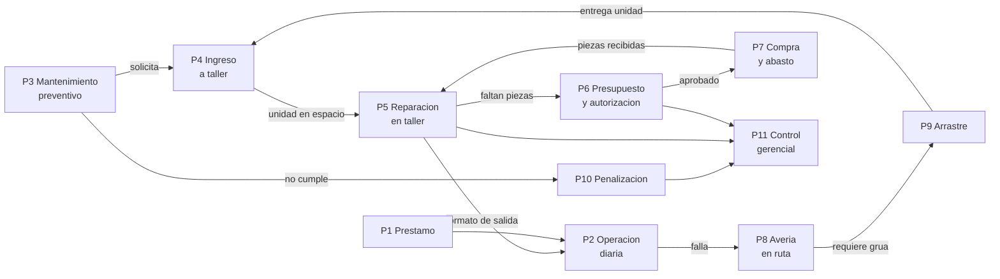

# Procesos de negocio — Sistema de Gestión de Flota y Taller (Baja Gas)

**Versión:** 1.1 · **Fecha:** 2026-08-15
**Documentos relacionados:** [requerimientos.md](requerimientos.md) · [modelo-er.md](modelo-er.md) · [casos-de-uso.md](casos-de-uso.md) · [agenda-mantenimiento.md](agenda-mantenimiento.md)

> **v1.1 — Tres cambios del cliente:**
> 1. **"Administrador" no es un rol, son cuatro.** Erick (compras y enlace con gerencia), Pedro
>    (piso de taller y almacén), Víctor (agenda de mantenimiento) y Pablo (operativo, suplente de
>    Pedro). La matriz de §3 se rehízo con esta separación.
> 2. **La penalización deja de ser automática.** El sistema solo avisa al gerente y a Erick; ellos
>    hablan con el chofer en persona y después marcan el caso como atendido. P10 se reescribió.
> 3. **La agenda de mantenimiento se gestiona sola.** El diseño completo está en
>    [agenda-mantenimiento.md](agenda-mantenimiento.md); resuelve el choque entre P3 y P4.
>
> Se mantiene de la v1.0: **los mecánicos no usan la aplicación**; toda interacción con ellos es en
> papel y pasa por Erick.

---

## 1. Qué cuenta como proceso

Un **proceso** tiene cuatro cosas que un caso de uso no necesariamente tiene:

1. Un **disparador** claro (un evento del mundo real, no un clic).
2. Un **dueño** — un solo rol responsable de que termine.
3. Un **resultado con valor** para el negocio.
4. **Traspasos** (*handoffs*) entre roles: el punto donde los procesos se rompen.

Por eso "consultar dashboard" es un caso de uso pero **no** un proceso, y "atender una unidad
varada" es un proceso aunque involucre siete casos de uso.

---

## 2. Inventario: 12 procesos

| # | Proceso | Tipo | Dueño | Traspasos |
|---|---|---|---|---|
| **P1** | Préstamo y transferencia de responsabilidad | Sustantivo | Chofer titular | 3 |
| **P2** | Operación diaria y supervisión de flota | Sustantivo | Supervisor | 2 |
| **P3** | Mantenimiento preventivo programado | Sustantivo | Chofer (poseedor) | 3 |
| **P4** | Ingreso a taller: solicitud y admisión | Sustantivo | Administrador | 4 |
| **P5** | Reparación en taller | Sustantivo | Administrador | **6** |
| **P6** | Presupuesto y autorización del gasto | Apoyo | Administrador | **6** |
| **P7** | Compra y abasto de piezas | Apoyo | Administrador | 5 |
| **P8** | Atención de avería en ruta | Sustantivo | Chofer (poseedor) | 4 |
| **P9** | Arrastre y traslado a taller | Sustantivo | Chofer de grúa | 5 |
| **P10** | Penalización por incumplimiento | Control | Gerente | 3 |
| **P11** | Control gerencial e indicadores | Control | Gerente | 2 |
| **P12** | Administración de datos maestros | Soporte | Administrador | 0 |

**7 sustantivos** (el negocio existe para hacerlos) · **2 de apoyo** · **2 de control** · **1 de soporte**.

---

## 3. Matriz actor × proceso

**E** = ejecuta · **D** = decide / autoriza · **I** = recibe información · **S** = suplente
**P** = participa fuera del sistema (papel, teléfono o en persona)

| Actor | P1 | P2 | P3 | P4 | P5 | P6 | P7 | P8 | P9 | P10 | P11 | P12 |
|---|:-:|:-:|:-:|:-:|:-:|:-:|:-:|:-:|:-:|:-:|:-:|:-:|
| Chofer | **E** | **E** | **E** | E | I | — | — | **E** | E | P | — | — |
| Otro chofer | **D** | — | — | — | — | — | — | — | — | — | — | — |
| Supervisor | D | **E** | I | I | — | — | — | E | I | I | — | — |
| **Erick** · compras y enlace | — | — | — | — | **E** | **E** | **E** | — | — | **E/P** | I | E |
| **Pedro** · piso y almacén | — | — | I | **E** | **E** | — | **E** | — | I | — | — | **E** |
| **Víctor** · agenda | — | — | **E/D** | **E/D** | I | — | — | — | — | I | — | I |
| **Pablo** · operativo | — | — | — | S | S | — | S | — | S | — | — | — |
| Chofer de grúa | — | — | — | — | — | — | — | I | **E/D** | — | — | — |
| Mecánico *(papel)* | — | — | — | — | **P** | **P** | — | P | — | — | — | — |
| Gerente | — | — | I | — | I | **D** | I | — | — | **D/P** | **E** | E |
| Almacén | — | — | — | — | — | — | **E** | — | — | — | — | — |
| Proveedor | — | — | — | — | — | — | P | — | — | — | — | — |
| Peritos | — | — | — | — | — | — | — | **P** | — | — | — | — |
| Programador de tareas | E | — | **E** | **E** | — | — | — | — | — | **E** | E | — |

### Lectura de la matriz

**El cuello de botella que reporté en la v1.0 estaba mal planteado.** Al modelar "Administrador"
como un solo actor, los cuatro procesos de taller parecían caer sobre una sola persona. Con la
separación real la carga se distribuye y cada proceso tiene un dueño distinto:

| Persona | Perfil en el sistema | Procesos que posee |
|---|---|---|
| **Erick** | Compras y enlace con gerencia | P5 *(captura)*, P6, P7 *(pedido)*, P10 |
| **Pedro** | Piso de taller y almacén | P4, P5 *(espacios y colas)*, P7 *(surtido)*, P12 |
| **Víctor** | Programación de mantenimiento | P3, P4 *(agenda)* |
| **Pablo** | Operativo / suplente | Cubre a Pedro en P4, P5, P7, P9 |

**Lo que sí queda como riesgo real, ya acotado:** **Erick es el único que captura el papel de los
mecánicos y el único enlace con el gerente**, y no tiene suplente nombrado. Pablo cubre a Pedro;
nadie cubre a Erick ni a Víctor. Si Erick falta, P5 deja de reportar avances y P6 se detiene por
completo. Eso ya no es un problema de diseño del sistema, es una decisión de la empresa sobre
suplencias — pero el sistema debe **permitirla**: `USUARIO_ROL` ya tiene `vigente_desde` y
`vigente_hasta`, así que dar un perfil temporal a otra persona no requiere código nuevo ni
cuentas compartidas.

**Nota de modelado:** los cuatro son **perfiles distintos con permisos distintos**, no un rol
"administrador" con cuatro usuarios. Víctor no debe poder autorizar órdenes de compra y Erick no
debe poder mover vehículos de espacio. Modelarlos como un solo rol haría que cualquiera pudiera
hacer todo, que es justo lo que un sistema de control debe evitar.

---

## 4. Los 12 procesos en detalle

En cada cadena, `→` es un traspaso entre actores y **⚙** marca cuando interviene el sistema.

---

### P1 — Préstamo y transferencia de responsabilidad

**Disparador:** el chofer titular se va de vacaciones o se incapacita.
**Resultado:** la responsabilidad técnica de la unidad queda en otra persona, con registro.
**Casos de uso:** CU-CHO-07, CU-CHO-08, CU-CHO-09, CU-SUP-04, CU-AUT-03.

| # | Interacción |
|---|---|
| 1 | **Chofer titular → ⚙** registra el préstamo: receptor, motivo y fecha de retorno |
| 2 | **⚙ → Supervisor + Chofer receptor** notifica la solicitud |
| 3 | **Supervisor → ⚙** autoriza o veta *(paso condicional, ver §6)* |
| 4 | **Chofer receptor → ⚙** acepta — **aquí cambia el poseedor** |
| 5 | **⚙ → Chofer titular** confirma que ya no responde por la unidad |
| 6 | **⚙ → ambos** al vencer la fecha, cierra el préstamo automáticamente |

**Dónde se rompe:** entre el paso 1 y el 4 hay una ventana en la que el préstamo está solicitado
pero no aceptado. Durante ese hueco **la responsabilidad sigue siendo del titular**, y eso tiene
que estar visible en pantalla — es exactamente el momento que un chofer usaría para argumentar
que "ya la había prestado".

---

### P2 — Operación diaria y supervisión de flota

**Disparador:** inicio de turno.
**Resultado:** el supervisor sabe en todo momento quién conduce qué y dónde.
**Casos de uso:** CU-CHO-03, CU-CHO-04, CU-SUP-01, CU-SUP-02, CU-SUP-05.

| # | Interacción |
|---|---|
| 1 | **Chofer → ⚙** abre jornada y ejecuta el checklist pre-operacional |
| 2 | **⚙ → Supervisor** el chofer aparece como "conduciendo" con su unidad |
| 3 | **Chofer (app) → ⚙** envía ubicación periódica durante la jornada |
| 4 | **Supervisor → ⚙** consulta mapa, cuadrilla y estado de cada unidad |
| 5 | **Chofer → ⚙** cierra jornada |

**Dónde se rompe:** todo el módulo del supervisor depende de que el chofer **abra la jornada**. Es
un dato autodeclarado. Sin telemetría instalada en la unidad, un chofer que no abre jornada
simplemente desaparece del tablero — y es justo el chofer que más querrías vigilar. Si el
proyecto quiere resistir eso, el arranque de jornada tiene que amarrarse a algo que el chofer no
controle (lectura del odómetro al cargar, marcaje en planta, o telemetría).

---

### P3 — Mantenimiento preventivo programado

**Disparador:** se cumple la fecha o el kilometraje del plan.
**Resultado:** la unidad entra al taller, o queda registrado que no entró.
**Casos de uso:** CU-CHO-02, CU-CHO-05, CU-AUT-01, CU-GER-02, CU-SUP-08.

| # | Interacción |
|---|---|
| 1 | **Programador de tareas → ⚙ → Chofer** recordatorio antes de que venza la ventana |
| 2 | **Chofer → Administrador** solicita ingreso *(entra a P4)* |
| 3 | **⚙ → Supervisor** si la ventana está por vencer sin solicitud, lo escala |
| 4 | **Programador → ⚙** si vence sin ingreso, genera penalización *(entra a P10)* |
| 5 | **⚙ → Gerente** el incumplimiento aparece en el dashboard |

**Dónde se rompe:** aquí está el conflicto de interés central del proyecto. El chofer gana por
comisión y el taller le cuesta ventas. El proceso solo funciona si el paso 3 existe: escalar al
supervisor **antes** de que el caso llegue al gerente. Si el sistema solo reporta a toro pasado,
genera resentimiento sin corregir la conducta.

**Cambio en v1.1:** el paso 2 ya no lo inicia el chofer. **Víctor agenda la cita** y el sistema se
la propone; el chofer solo confirma que se presentará. Eso quita el conflicto de interés del
camino crítico: el chofer ya no puede "olvidar" solicitar el ingreso, porque no depende de él.

---

### P4 — Ingreso a taller: solicitud y admisión

**Disparador:** el chofer solicita entrar.
**Resultado:** la unidad ocupa un espacio del taller, o la solicitud queda en cola o rechazada.
**Casos de uso:** CU-CHO-05, CU-CHO-06, CU-ADM-01, CU-ADM-02, CU-ADM-04.

| # | Interacción |
|---|---|
| 1 | **Chofer → ⚙ → Administrador** envía el formulario de solicitud |
| 2 | **Administrador → ⚙** consulta espacios libres **compatibles con el tipo de unidad** |
| 3 | **Administrador → Chofer** acepta con fecha, deja en cola, o rechaza con motivo |
| 4 | **Chofer → Administrador** se presenta físicamente en la fecha asignada |
| 5 | **Administrador → ⚙** coloca la unidad en un espacio |
| 6 | **⚙ → Supervisor** la unidad cambia a estado "en taller" |

**Resuelto en v1.1.** Antes este proceso chocaba con P3: si el taller rechazaba al chofer por
falta de espacio y luego vencía la ventana, el sistema lo castigaba por un problema que no era
suyo. La solución fue **separar la fecha límite de la cita**: la fecha límite viene del plan y no
se mueve; la cita la asigna la agenda según la capacidad real y sí se mueve. El chofer solo
incumple si **faltó a una cita confirmada**. Si el taller nunca pudo dársela, el reporte sale
contra el taller, no contra él. Diseño completo en
[agenda-mantenimiento.md](agenda-mantenimiento.md).

**Lo que queda por cuidar:** la capacidad se cuenta **por tipo de espacio**, no en total. El
taller puede estar lleno de pipas y tener espacios de reparto libres; decir "el taller está lleno"
es lo que haría fallar el cálculo.

---

### P5 — Reparación en taller

**Disparador:** la unidad queda colocada en un espacio.
**Resultado:** unidad reparada y entregada con formato de salida.
**Casos de uso:** CU-ADM-05, CU-ADM-06, CU-ADM-11, CU-ADM-14, CU-ADM-15, CU-ADM-10.

| # | Interacción |
|---|---|
| 1 | **Administrador → ⚙** asigna la cola de especialistas (mecánico, carrocero, electricista) |
| 2 | **Administrador → Mecánico** *(papel)* entrega la hoja de trabajo impresa |
| 3 | **Mecánico → Administrador** *(papel)* devuelve el diagnóstico escrito |
| 4 | **Administrador → ⚙** captura el diagnóstico |
| 5 | *(si faltan piezas)* → **entra a P6** |
| 6 | **Mecánico → Administrador** *(papel/verbal)* reporta avance y término |
| 7 | **Administrador → ⚙** registra el avance |
| 8 | **Administrador → Chofer** emite y firma el formato de salida |

**Dónde se rompe:** **seis traspasos, cuatro de ellos en papel.** Después de la v1.1 este es el
proceso más frágil del sistema. Dos consecuencias que hay que decir en voz alta:

- La ocupación del taller "en tiempo real" que ve el gerente (CU-GER-03) **no es en tiempo
  real**: tiene el retraso de lo que tarde el administrador en teclear.
- Si el administrador se enferma o sale de vacaciones, **el taller entero deja de reportar**. No
  hay respaldo.

---

### P6 — Presupuesto y autorización del gasto

**Disparador:** el mecánico detecta que faltan piezas.
**Resultado:** presupuesto aprobado o rechazado por gerencia.
**Casos de uso:** CU-ADM-12, CU-ADM-13, CU-ADM-07, CU-GER-08, CU-ADM-16.

| # | Interacción |
|---|---|
| 1 | **Mecánico → Administrador** *(papel)* entrega el presupuesto y la lista de piezas |
| 2 | **Administrador → ⚙** captura el presupuesto y el desglose |
| 3 | **Administrador → ⚙ → Gerente** remite para autorización |
| 4 | **Gerente → ⚙** aprueba, rechaza, **o devuelve con comentarios** |
| 5 | **⚙ → Administrador** notifica el resultado |
| 6 | **Administrador → Mecánico** *(verbal/papel)* le avisa el resultado |
| 7 | *(si aprobado)* → **entra a P7** |

**Dónde se rompe:** el paso 4 cuando el gerente **devuelve**. El ciclo completo se repite,
incluyendo los dos traspasos en papel. Cada vuelta son días de unidad parada — y las unidades
paradas más de 3 meses (P11) casi siempre se explican por vueltas acumuladas aquí. Por eso el
modelo ER guarda el historial de `AUTORIZACION` en vez de dos columnas: para poder demostrar
dónde se fue el tiempo.

---

### P7 — Compra y abasto de piezas

**Disparador:** presupuesto aprobado.
**Resultado:** las piezas llegan al taller.
**Casos de uso:** CU-ADM-08, CU-ADM-09, CU-GER-05.

| # | Interacción |
|---|---|
| 1 | **Administrador → ⚙** genera la orden de compra *(solo si el presupuesto está aprobado)* |
| 2 | **Administrador → Almacén** solicita surtido de lo que hay en existencia |
| 3 | **Almacén → Administrador** entrega o informa el faltante |
| 4 | **Administrador → Proveedor** *(fuera del sistema)* coloca el pedido |
| 5 | **Proveedor → Administrador** confirma fecha estimada y luego entrega |
| 6 | **Administrador → ⚙** actualiza estatus y registra la recepción |
| 7 | **⚙ → Gerente** aparece como "piezas en camino" |

**Dónde se rompe:** el proveedor no está en el sistema. El indicador de "piezas en camino" que ve
el gerente vale exactamente lo que valga la disciplina del administrador para actualizarlo. Es un
dato de segunda mano presentado como si fuera de primera.

---

### P8 — Atención de avería en ruta

**Disparador:** la unidad se detiene fuera de las instalaciones.
**Resultado:** la unidad queda atendida y, si aplica, con peritaje registrado.
**Casos de uso:** CU-CHO-10, CU-CHO-11, CU-CHO-12, CU-CHO-13, CU-SUP-06, CU-SUP-07, CU-SUP-09.

| # | Interacción |
|---|---|
| 1 | **Chofer → ⚙** reporta la avería; el sistema captura la ubicación |
| 2 | **⚙ → Supervisor + Chofer de grúa** alerta en tiempo real; la unidad queda visible |
| 3 | *(si es vialidad pública)* **Chofer → Peritos** llamada **fuera del sistema** |
| 4 | **Peritos → Chofer → ⚙** el chofer captura el folio del peritaje |
| 5 | **Chofer → ⚙** hasta aquí se habilita solicitar arrastre o auxilio mecánico |
| 6 | **Supervisor → ⚙** escala si nadie respondió *(o registra el envío de un mecánico a sitio)* |

**Dónde se rompe:** el paso 3 ocurre por teléfono, fuera del sistema. El sistema puede **exigir**
el folio, pero no puede **verificarlo**: un chofer apurado puede inventar un número. Lo que sí
logra el diseño es dejar constancia de que se le exigió, que es lo que protege a la empresa. Vale
la pena decirlo así en la defensa del proyecto, en vez de presentarlo como un control infalible.

---

### P9 — Arrastre y traslado a taller

**Disparador:** la unidad varada no puede moverse por su cuenta.
**Resultado:** la unidad queda en un taller, con registro de quién, qué y dónde.
**Casos de uso:** CU-MON-01 a CU-MON-07, CU-CHO-13.

| # | Interacción |
|---|---|
| 1 | **⚙ → Chofer de grúa** alerta con la ubicación reportada por el chofer |
| 2 | **Chofer de grúa → ⚙** acepta el arrastre |
| 3 | **⚙ → Chofer** le muestra al chofer de grúa en el mapa; ambos comparten ubicación |
| 4 | **Chofer de grúa → ⚙** registra llegada al sitio y adjunta evidencia fotográfica |
| 5 | **Chofer de grúa → Administrador** entrega física de la unidad en el taller destino |
| 6 | **Chofer de grúa → ⚙** cierra el arrastre: taller destino, unidad, **chofer responsable**, hora |
| 7 | **⚙ →** se encadena con P4/P5 abriendo la orden de servicio |

**Dónde se rompe:** el paso 6. "Chofer responsable" debe seguir siendo **el poseedor de la
unidad**, no el chofer de grúa que la movió. Si esto se modela mal, la responsabilidad se
transfiere sin querer y se rompe RN-01, que es la regla que sostiene todo el sistema.

---

### P10 — Atención de incumplimiento de mantenimiento

> **Reescrito en v1.1.** Ya no es un proceso de castigo automático. El sistema **avisa**; el trato
> con el chofer ocurre en persona y fuera de la aplicación.

**Disparador:** el chofer **no se presentó a una cita confirmada**, o la canceló sin reagendar.
**Resultado:** el caso queda conversado y marcado como atendido, con constancia de quién lo cerró.
**Dueño:** Gerente.
**Casos de uso:** CU-AUT-01 *(renombrado a "Generar aviso de incumplimiento")*, CU-GER-02.

| # | Interacción |
|---|---|
| 1 | **Programador de tareas → ⚙** detecta la falta a una cita confirmada |
| 2 | **⚙ → Gerente + Erick** aviso con unidad, chofer **poseedor**, servicio y días de atraso |
| 3 | **Gerente → Chofer** habla con él **en persona** *(fuera del sistema)* |
| 4 | **Erick → Chofer** llamada de atención *(fuera del sistema)* |
| 5 | **Gerente o Erick → ⚙** marca el caso como **atendido**, con nota de lo acordado |
| 6 | **⚙ → Supervisor** queda informado de que el caso se cerró |

**Lo que gana este diseño:** es más honesto que una penalización automática. El sistema hace lo
único que puede hacer bien —detectar y avisar— y deja la sanción donde realmente ocurre, que es en
la conversación. Además elimina la necesidad de definir montos, descuentos y procesos de
inconformidad que nadie iba a mantener.

**Dos cosas que hay que cuidar:**

1. **Los avisos sin atender se acumulan.** Si nadie marca el caso como cerrado, en tres meses hay
   cuarenta avisos abiertos y el tablero deja de significar algo. Propuesta: recordatorio a los 3
   días y escalamiento al gerente a los 7, con el mismo mecanismo recurrente de la alerta de 3
   meses (RN-08).
2. **No llamarlo "penalización" en la interfaz.** No lo es. Es un **aviso de incumplimiento**.
   Nombrarlo mal genera la expectativa de un castigo que el sistema no aplica, y el primer chofer
   que reclame va a tener razón. En el modelo ER, la entidad `PENALIZACION` debe renombrarse a
   `AVISO_INCUMPLIMIENTO` y cambiar sus campos: se va `dias_atraso` como base de sanción y entran
   `atendido_por_usuario_id`, `fecha_atencion` y `nota_atencion`.

**Cuándo NO se genera aviso** (lo resuelve la agenda automática, ver
[agenda-mantenimiento.md](agenda-mantenimiento.md) §6): si el taller nunca pudo darle cita antes
de la fecha límite, el incumplimiento **no es del chofer**. En ese caso el sistema alerta a Víctor
y al gerente por un problema de **capacidad del taller**, que es un asunto distinto y va a otro
tablero.

---

### P11 — Control gerencial e indicadores

**Disparador:** continuo, más alertas automáticas.
**Resultado:** decisiones de dirección sobre flota y taller.
**Casos de uso:** CU-GER-01 a CU-GER-09, CU-AUT-02.

| # | Interacción |
|---|---|
| 1 | **⚙ → Gerente** dashboard: incumplimiento, ocupación, tiempos, piezas, unidades atendidas |
| 2 | **Programador → ⚙ → Gerente** alerta de unidad con más de 3 meses parada, **recurrente** |
| 3 | **Gerente → Administrador** exige explicación *(fuera del sistema)* |
| 4 | **Gerente → ⚙** marca la alerta como atendida |

**Dónde se rompe:** el paso 4. La alerta se apaga cuando el **gerente la marca**, no cuando la
unidad realmente sale del taller. Eso permite silenciarla sin resolver nada. Decisión pendiente:
o la alerta solo se cierra cuando la unidad cambia de estado, o se registra explícitamente que fue
un cierre manual y quién lo hizo.

---

### P12 — Administración de datos maestros

**Disparador:** alta o cambio en la organización (nuevo chofer, nueva unidad, nuevo espacio).
**Resultado:** los catálogos reflejan la realidad.
**Casos de uso:** CU-GEN-03, CU-ADM-03.

| # | Interacción |
|---|---|
| 1 | **Administrador o Gerente → ⚙** da de alta usuarios, unidades, talleres, espacios, piezas, planes y **técnicos** |

**Dónde se rompe:** es el único proceso sin traspasos, y por eso mismo el que nadie se apropia.
Hoy lo comparten administrador y gerente, que en la práctica suele significar que **ninguno** lo
mantiene. Hay que asignarle un dueño único.

---

## 5. Cómo se encadenan los procesos

Hay **dos ciclos** en el sistema, y los dos importan:

- **El ciclo sano:** P2 → P3 → P4 → P5 → P2. La unidad opera, se mantiene, vuelve a operar.
- **El ciclo caro:** P5 → P6 → P7 → P5. Cada vuelta suma días de unidad parada. Cuando este ciclo
  gira más de dos o tres veces, la unidad termina disparando la alerta de los 3 meses (P11).

---

## 6. Decisiones pendientes que cambian los procesos

### Resueltas en v1.1

| # | Pregunta | Respuesta del cliente |
|---|---|---|
| ~~1~~ | ¿Qué es una penalización y quién la cancela? | **No hay penalización.** El sistema avisa a gerente y a Erick; ellos hablan con el chofer y marcan el caso como atendido → P10 reescrito |
| ~~2~~ | ¿Un rechazo del taller congela el reloj? | **Sí, por diseño.** Se separó la fecha límite de la cita; solo se incumple faltando a una cita confirmada → [agenda-mantenimiento.md](agenda-mantenimiento.md) |
| ~~4~~ | ¿Cuántos administradores hay por taller? | **Cuatro, con funciones distintas:** Erick, Pedro, Víctor y Pablo → matriz de §3 |

### Abiertas

| # | Pregunta | Proceso afectado |
|---|---|---|
| 1 | ¿Quién cubre a **Erick** y a **Víctor** cuando faltan? Pablo solo cubre a Pedro | P5, P6, P7 — es el único punto de falla que queda |
| 2 | ¿Cuánto dura cada **tipo de servicio**? Sin ese catálogo la agenda no calcula nada | P3, P4 — es el primer dato que hay que levantar |
| 3 | ¿Cuál es la **prioridad operativa** entre unidades? Propuse pipa > reparto > utilitario | P3, P4 |
| 4 | ¿Cuánta **anticipación mínima** merece un chofer antes de moverle la cita? Propuse 48 h | P3, P4 |
| 5 | ¿El préstamo requiere visto bueno del supervisor? | P1 — elimina o conserva el paso 3 |
| 6 | ¿La alerta de 3 meses se cierra sola o la cierra el gerente? | P11 |
| 7 | ¿Hay monto máximo que **Erick** apruebe sin gerente? | P6 — quitaría vueltas al ciclo caro |
| 8 | ¿El taller opera **sábados**? El cálculo de capacidad lo necesita | P3, P4 |
